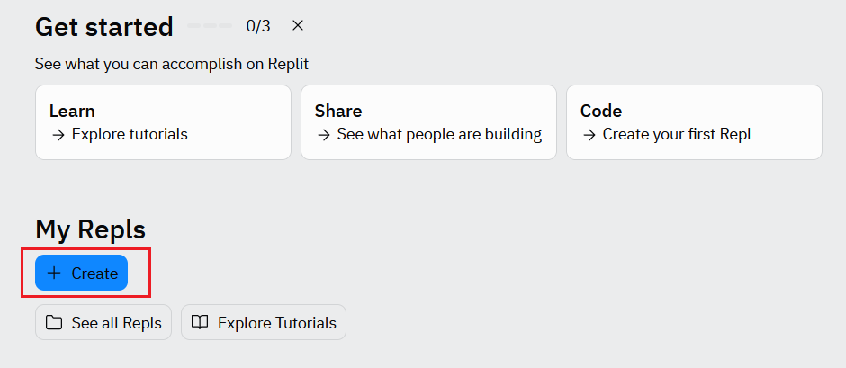
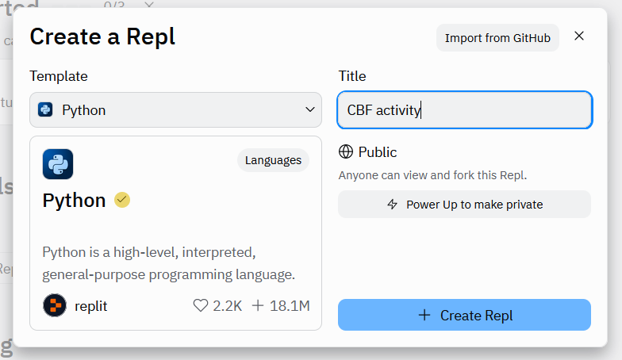
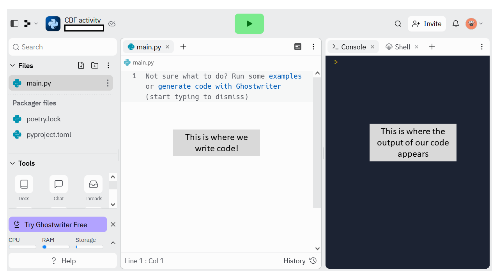
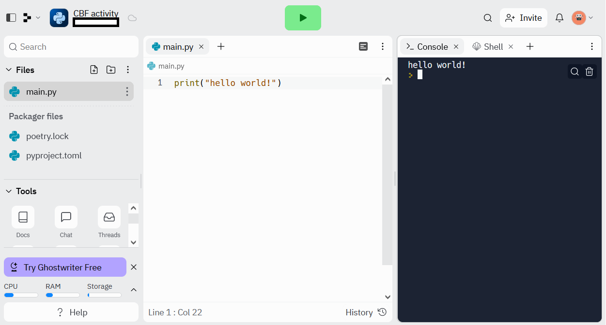
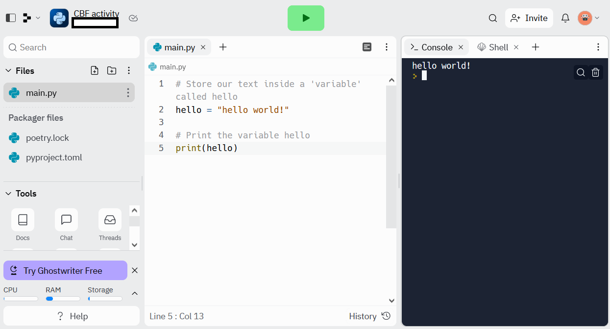
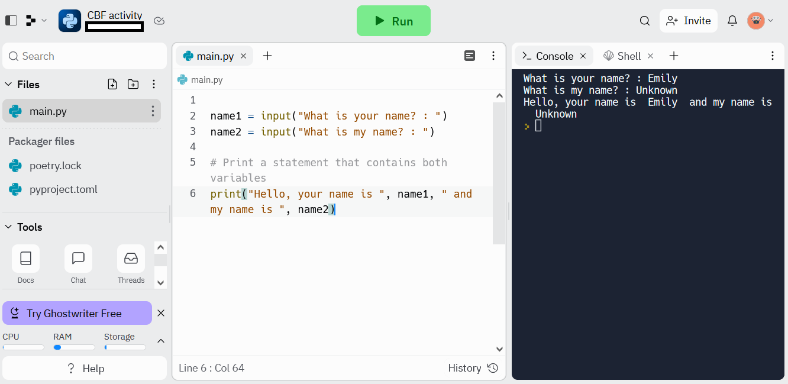

```{r setup, include=FALSE}
knitr::opts_chunk$set(echo = TRUE)
```

<br>

# Introduction

You can think of programming as a language that we use to talk to and be understood by computers. Like all languages you need to know the vocabulary and grammar. As you learn to program you develop problem solving skills. These problem solving skills are broadly applicable across all programming languages, so after learning one language you can learn a second much more easily.

We have selected python for you to learn as it was designed to be easier for a human to read and write.

<br>

# replit

For these activities we will be using `replit`, a free online IDE. An IDE (integrated development environment) is an interactive way to build, test and edit code. Replit is just one of many, the link to it can be found here: <https://replit.com/>

You first need to create an account.

After this, Replit will ask you how familiar you are with programming. For now, we'll click 'no I've got this' as we can always return to these tutorials later.

We first need to create a 'repl' for this project.



<br>

We will be prompted to choose a language and give the project a title. Choose 'python' for the language. You can name the repl whatever you like but here I suggest 'CBF activity'. After you're done click '+ Create Repl' and we can begin our first coding activity.



<br> <br>

# Hello world!

A program is a precise set of instructions expressed in a programming language. The machine then translates this programming language into a form it can understand - machine code. We are now going to write our first python program using Replit.

There will already be a python script open called 'main.py'. We'll start by writing our code in this. The output of this script will appear on the right in the 'console'.



<br>

To begin, we will start with what is known as a 'Hello World!' script. These are usually the starting point of learning any programming language. Copy and paste (or type) the following code into 'main.py':

```{python, eval=FALSE}
print("hello world!")

```

Then click the green button that says 'run', your output should look something like this:



<br>

Our program used the command `print` to print out the text inside the quotation marks (this is equivalent to the `say` block in scratch). We could store this text in something known as a variable and then print this variable out.

An example of this is below. Note the lines that begin with '#', these are comments to remind us what our code does and aren't read by the interpreter.

```{python, eval=FALSE}

# Store our text inside a 'variable' called hello
hello = "hello world!"

# Print the variable hello
print(hello)

```

You can see that this code does the same thing:



<br>

Challenge: can you make the program print out something else? Anything you like.

<br> <br>

# Interactive inputs

Normally, we don't want our programs just to print out text. Some programs might expect user interaction. 
Next, we are going to write a program the prompts a user for an input, in this case your name. It stores the name in the variable 'name' and then prints the name out.

```{python, eval=FALSE}

# Use the 'input' command to ask the user to provide an input and store it in variable 'name'
name = input("Enter name: ")

# Print the variable hello
print("Hello, your name is", name)

```

<br>

Let's try and make this more complicated. We'll write a program that imagines you're having a conversation with a robot. It will first ask you for your name, then it will ask you to name it. The program will then print out your name and the name you gave it.

```{python, eval=FALSE}

# Use the 'input' command to ask the user to provide an input and store it in variable 'name'
name1 = input("What is your name? : ")
name2 = input("What is my name? : ")

# Print the variable hello
print("Hello, your name is ", name1, " and my name is ", name2)

```



<br>


<br>

Challenge: can you create a program that takes <b>three</b> inputs and then prints out a statement that includes all three inputs?

<br>
<br>

# Conclusions

We have wrote our first python programs using replit - well done!


