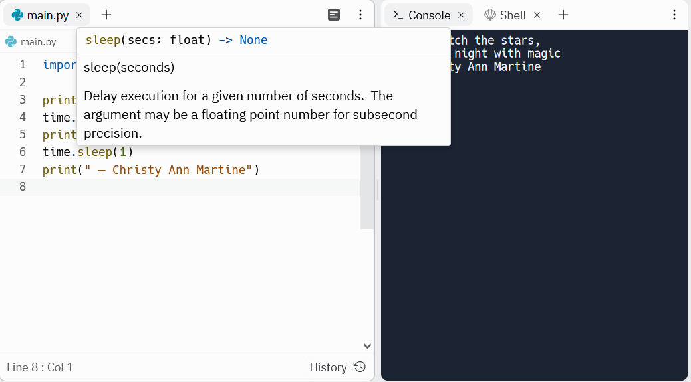

```{r setup, include=FALSE}
knitr::opts_chunk$set(echo = TRUE)
```

<br>

# Introduction

Ada Lovelace, the first programmer, was the daughter of British poet Lord Byron. Lord Byron was a controversial figure and one of the earliest celebrities. He was famous for various love affairs and scandals. He married Annabella Milbanke, a wealthy heiress interested in maths and science. Byron jokingly referred to her as "the princess of parallelograms". Their marriage only lasted a year.

<br>

<center>

{width="505"}

</center>

<br>

Growing up, Ava Lovelace received tutoring in mathematics. Her mother encouraged this, not just because she strongly believed in women's education, but also to counter the perceived dangerous poetic tendencies of her father. Her legacy is one that sees the beauty in mathematics and science.

<br>

<center>

{width="514"}

</center>

<br>

In this activity we bring programming together with poetry. The aim of this activity is to print and format a poem using python.

<br> <br>

# Print a poem in python

Before beginning we might want to create a new repl in replit. This allows us to work on multiple different projects/activities at once. If you are already working in a different repl and want to return to your home page click the symbol in the top left corner, followed by 'home':


<br>

We can then create a new repl as in activity 1, this time we might call it something like 'CBF poem':


<br>

Once our new repl is set up we can begin the activity. Let's write a python program that will print out each line of a poem. Here we will use <i>"Hope" is the thing with feathers</i> by Emily Dickinson:

<br>

> "Hope" is the thing with feathers -
>
> That perches in the soul -
>
> And sings the tune without the words -
>
> And never stops - at all -
>
> <br>
>
> And sweetest - in the Gale - is heard -
>
> And sore must be the storm -
>
> That could abash the little Bird
>
> That kept so many warm -
>
> <br>
>
> I've heard it in the chillest land -
>
> And on the strangest Sea -
>
> Yet - never - in Extremity,
>
> It asked a crumb - of me.

<br>

In our [first activity](activity1.html) we learned about the `print` function. To print out the first stanza of this poem we could use the following program:

```{python, eval=FALSE}
print("Hope is the thing with feathers—")
print("That perches in the soul—")
print("And sings the tune without the words—")
print("And never stops—at all—")

```

<br>

The output of this program will appear in the terminal like this:


<br>

Do you have a favourite poem? Try and print the first stanza out using a python script.

Don't worry if you can't think of any, you can explore a list of poems below:

-   [Poets.org](https://poets.org/national-poetry-month)

-   [PoetryFoundation.org](https://www.poetryfoundation.org/)

-   [FamousPoetsAndPoems.com](http://famouspoetsandpoems.com/)

Or use PoetryFoundation's [poem of the day](https://www.poetryfoundation.org/poems/poem-of-the-day).

<b>Challenge:</b> can you print more than one stanza? Can you leave a space between the stanzas?

<br>

<b>Solution (click the 'code' button to the right to reveal the code)</b>:

```{python, eval=FALSE, class.source = 'fold-hide'}

# '\n' is a python sequence that means 'print a new line' 

print("Hope is the thing with feathers—")
print("That perches in the soul—")
print("And sings the tune without the words—")
print("And never stops—at all—")
print("\n")
print("And sweetest - in the Gale - is heard -")
print("And sore must be the storm -")
print("That could abash the little Bird")
print("That kept so many warm -")
print("\n")

```

<br> <br>

# Improve it

Our code currently prints all the lines of our poem at once. But maybe we want to give each line some time to 'breath'. We can modify our program to add a delay between each line.

There is a python package called 'time'. Python packages contain additional commands that don't come installed with python, and allow us to carry out certain extra tasks. The package 'time' contains a function called `sleep` that lets us add a pause between each line. Before we can use `sleep` we need to tell python to load the package 'time'. We do this using the `import` command:

<br>

<center>


</center>

<br>

Once we've imported the package we can then use it. An example of loading 'time' and using `sleep` is below:

```{python, eval=FALSE}

import time 

print("Let's watch the stars,")
time.sleep(1) 
print("fill the night with magic")
time.sleep(1) 
print(" — Christy Ann Martine")


```

You might notice that we need to include the package name 'time' before `sleep` when we use it. This is because python won't recognise the function `sleep` on its own, it needs to know it comes from 'time'. If we hover over the names of the functions replit will give us some information about that function.



<br>

If we used the sleep function on our earlier poem the program would be:

```{python, eval=FALSE}

import time 

print("Hope is the thing with feathers—")
time.sleep(1.2) 
print("That perches in the soul—")
time.sleep(1.2) 
print("And sings the tune without the words—")
time.sleep(1.2) 
print("And never stops—at all—")

```


<b>Challenge:</b> now try and add a pause between each line of the poem you selected earlier.

<br> <br>

# Conclusions

In this activity we have learned to format and print out a poem using python. We have also learned how we can use functions such as 'sleep' for a more dramatic effect.

You might wonder how this could be used in later work. Here we have shown you a simple example of loading and using a package that doesn't come installed with python. Additionally, many games are written using python as a programming language. These might have blocks of text or dialogue that we might want to space out and format. You could use the skills learned here to do so. When writing software, programmers often like to include quotes as outputs to keep their users entertained and show that the software is doing something.


