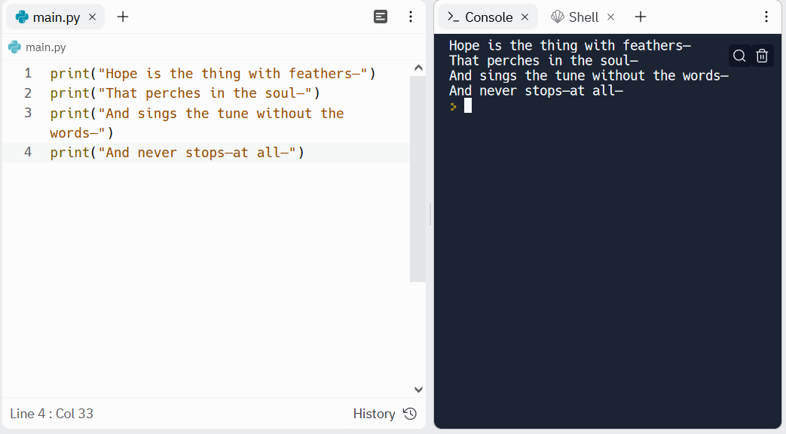

```{r setup, include=FALSE}
knitr::opts_chunk$set(echo = TRUE)
```

<br>

# Introduction

Ada Lovelace, the first programmer, was the daughter of British poet Lord Byron.

<br>

<center>

{width="505"}

</center>

<br> <br>

# Print a poem in python

Let's write a python program that will print out each line of a poem. Here we will use <i>"Hope" is the thing with feathers</i> by Emily Dickinson.

```{python, eval=FALSE}
print("Hope is the thing with feathers—")
print("That perches in the soul—")
print("And sings the tune without the words—")
print("And never stops—at all—")

```

The output of this program will appear in the terminal like this:



Do you have a favourite poem? Try and print the first stanza out using a python script.

Don't worry if you can't think of any, you can explore a list of poems below:

-   Poets.org

-   PoetryFoundation.org

-   ButtonPoetry.com

-   FamousPoetsAndPoems.com


