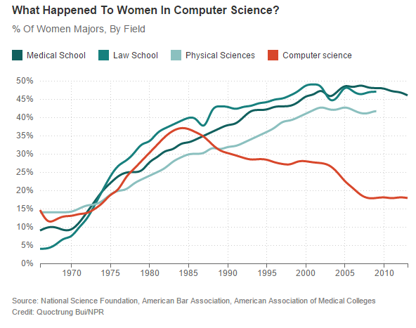
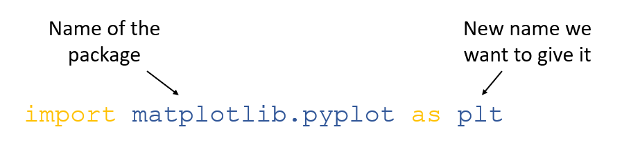

```{r setup, include=FALSE}
knitr::opts_chunk$set(echo = TRUE)
```

<br>

# Introduction

One of the most popular uses for python is for data analysis and visualisation. You might have created a graph in MicroSoft Excel before. During this process we have to click around the software to modify our graph's appearance/what data it takes as an input. This might not take too much time if you're only doing it once but what if you had to make similar graphs another ten times? A hundred times? Or a thousand times? The process would quickly get very boring, take a lot of time, and you'd be more likely to make mistakes.

We can use a python package called `matplotlib` to help us plot data using python. In this case, our program is a series of instructions telling matplotlib what data to use and how to format it. Its very customisable and you can use the same code over and over again.

<br> <br>

# Python plotting

## Women in STEM

In the following activity we are going to create our own customised version of the following graph:

<br>

<center>



</center>

<br>

We will use our own colours, line widths and line styles! In our previous activities we used replit to run all our code contained in a python script. This was ideal as we wanted to run all our code in one go. However, in this activity we want to be able to customise our graphs in an interactive way. Because of this we are going to use a type of python notebook called a 'Jupyter notebook'. A Jupyter notebook allows you to create small blocks of code and run the blocks one at a time. You can make changes to just one block and see what happens.

We have created an empty Jupyter notebook for you to use at the following link: [insert](link). It should look like this:

<br>

<br>

### Load our packages

In the previous activity we loaded a python package called `sleep` that contained functions to let python carry out additional tasks. Python does not know how to process and plot data on its own. So in this activity we're going to need to load two extra packages known as 'pandas' and 'matplotlib'. 'Pandas' is a package that lets python read and edit data, much like you'd use Excel to process raw data. 'Matplotlib' is the package that then lets us plot the data. We'd load them by pasting the following code into our first chunk and pressing the play button:

```{python}

import matplotlib.pyplot as plt
import pandas as pd

```

<br>

You might notice the code is slightly different from activity 2.

Instead of `import <packagename>` we have `import <packagename> as <newname>` .

In activity 2, we mentioned that to use the functions contained inside a package we need the package name, then a full stop, then the function, like so:

`time.sleep`

<br>

However, 'Matplotlib.pyplot' is quite a lot of letters to type every time! Each time we used it we'd have to type:

`matplotlib.pyplot.plot`

<br>

Instead, we can rename the package as we import it to something simple and easy to remember. In this case 'plt'. So the above line of code would become:

`plt.plot`

<br>

To summarise, this is how we load and rename a package:

<br>

<center>

{width="535"}

</center>

<br> <br>


### Load the data

The data we're going to be using can be found [here](https://raw.githubusercontent.com/ejjohnson93/ejjohnson93.github.io/main/data/women_stem_data.csv). We are going to load it using the package mentioned earlier 'pandas'. Remember, we have loaded 'pandas' and renamed it to 'pd'. 

<br>

So the code to load the data is: 

```{python}

data = pd.read_csv("https://raw.githubusercontent.com/ejjohnson93/ejjohnson93.github.io/main/data/women_stem_data.csv")

```

In this case we use the `read_csv` function contained inside the 'pandas' package to load the data at the url. We then store it in a variable called 'data' using the equals sign.  

<br><br>


### Plot it!


<br><br>

### Make it pretty!

<br><br>

# Supplementary activities

## Map creation

<br> <br>


