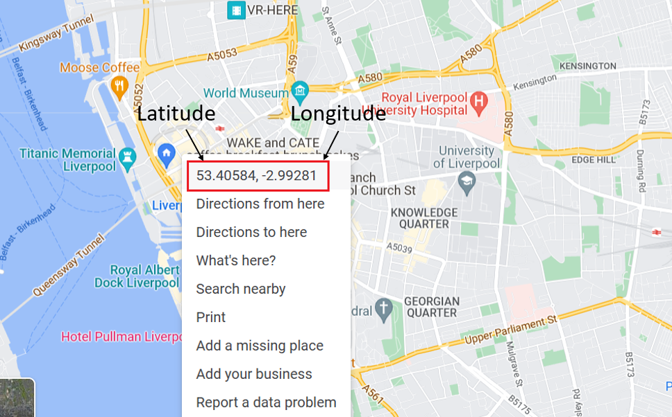
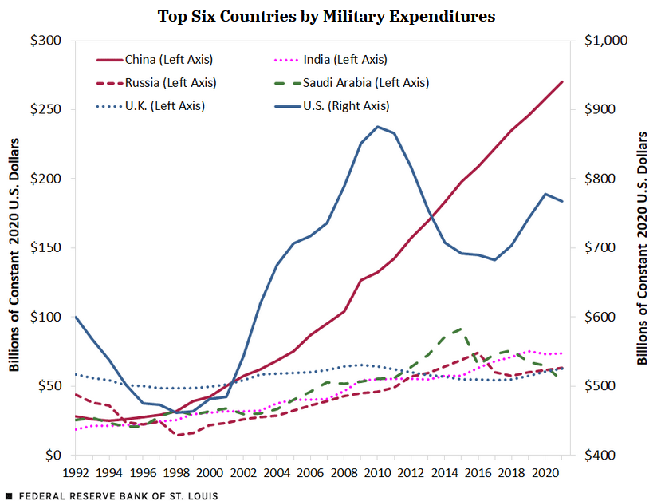

```{r setup, include=FALSE}
knitr::opts_chunk$set(echo = TRUE)
```

<br>

# Introduction

One of the most popular uses for python is for data analysis and visualisation. You might have created a graph in MicroSoft Excel before. During this process we have to click around the software to modify our graph's appearance/what data it takes as an input. This might not take too much time if you're only doing it once but what if you had to make similar graphs another ten times? A hundred times? Or a thousand times? The process would quickly get very boring, take a lot of time, and you'd be more likely to make mistakes.

We can use a python package called `matplotlib` to help us plot data using python. In this case, our program is a series of instructions telling matplotlib what data to use and how to format it. Its very customisable and you can use the same code over and over again.

This activity is a little more difficult than the ones before it. Don't worry if you don't understand how all the code works. Here you will mostly copy and paste it and just edit snippets. The aim is to show you how python is used for plotting since this is important in lots of jobs like data science and research!

<br> <br>

# Python plotting

## Women in STEM

In the following activity we are going to create our own customised version of this graph:

<br>

<center>


</center>

<br>

We will use our own colours, line widths and line styles. In our previous activities we used replit to run all our code contained in a python script. This was ideal as we wanted to run all our code in one go. However, in this activity we want to be able to customise our graphs in an interactive way. Because of this we are going to use a type of python notebook called a 'Jupyter notebook'.

We have created an empty Jupyter notebook for you to use at the following [link](https://mybinder.org/v2/gh/ejjohnson93/outreach_jupyter/HEAD?labpath=index.ipynb). Don't worry if it takes a while to load! As long as the circles are spinning it is just booting up, this might take 5 minutes or so. Once it has finished loading it should look like this:

<br>

<center>


</center>

<br>

Jupyter notebooks contain chunks of written text and code blocks. In the previous activities we wrote scripts using replit. The script was then ran all at once. Jupyter notebooks let you create small blocks of code and run each separately.

For this activity we will be pasting the code from this page into the empty code chunks, pressing 'play' and seeing what happens. We have also included several challenges to let you modify the code!

<br>

<center>


</center>

If you get stuck inserting your code we have also created a version of the same notebook but with the code chunks already pasted for you. The link is [here](https://mybinder.org/v2/gh/ejjohnson93/outreach_jupyter/HEAD?labpath=all_code.ipynb).

<br>

<br>

### Load our packages

In the previous activity we loaded a python package called `sleep` that contained functions to let python carry out additional tasks. Python does not know how to process and plot data on its own. So in this activity we're going to need to load two extra packages known as 'pandas' and 'matplotlib'. 'Pandas' is a package that lets python read and edit data, much like you'd use Excel to process raw data. 'Matplotlib' is the package that then lets us plot the data. We load them by pasting the following code into our first chunk and pressing the play button:

```{python}

import matplotlib.pyplot as plt
import pandas as pd

```

<br>

You might notice the code is slightly different from activity 2.

Instead of `import <packagename>` we have `import <packagename> as <newname>` .

In activity 2, we mentioned that to use the functions contained inside a package we need the package name, then a full stop, then the function, like so:

`time.sleep`

<br>

However, 'Matplotlib.pyplot' is quite a lot of letters to type every time! Each time we used it we'd have to type:

`matplotlib.pyplot.plot`

<br>

Instead, we can rename the package as we import it to something simple and easy to remember. In this case 'plt'. So the above line of code would become:

`plt.plot`

<br>

In summary, this is how we load and rename a package:

<br>

<center>

{width="535"}

</center>

<br> <br>

### Load the data

The data we're going to be using can be found [here](https://raw.githubusercontent.com/ejjohnson93/ejjohnson93.github.io/main/data/women_stem_data.csv). We are going to load it using the package mentioned earlier 'pandas'. Remember, we have loaded 'pandas' and renamed it to 'pd'.

<br>

The code to load the data is:

```{python}

data = pd.read_csv("https://raw.githubusercontent.com/ejjohnson93/ejjohnson93.github.io/main/data/women_stem_data.csv")

```

In this case we use the `read_csv` function contained inside the 'pandas' package to load the data at the url. We then store it in a variable called 'data' using the equals sign.

We can view the data by typing the name of the variable in a code chunk:

```{python}

data

```

<br><br>

### Plot it!

Now that our data is loaded we can start plotting it. We are going to create a line graph. A line graph has an x-axis and a y-axis. In this case our x-axis is time in years. Our y-axis is the percentage of majors that are women.

Lets begin by just plotting the data for computer science.

```{python}

x = data["Date"]

```

```{python}

y = data["Comp Sci"]

```

```{python}

plt.plot(x, y)
plt.show()

```

Our plot is currently missing labels for the a-xis and y-axis... but Matplotlib lets us layer up the different features of our plot. Let's now add x and y axis labels:

```{python}

plt.plot(x, y)
plt.xlabel('Year')
plt.ylabel('% women majors')
plt.show()

```

<br>

That's a bit better... but we should also include a key for data so a reader understands what the line refers to.

```{python}

plt.plot(x, y, label = "Computer Science")
plt.xlabel('Year')
plt.ylabel('% women majors')
plt.legend()
plt.show()

```

<br>

Now lets include the data for the other subjects. We can store each subject in a new y data variable. We'll call them y, y2, y3 and y4. y contains the data for computer science, y2 contains the data for law, y3 contains the data for medical school and y4 contains the data for the physical sciences.

```{python}

y = data["Comp Sci"]
y2 = data["Law"]
y3 = data["Medical school"]
y4 = data["Physical sciences"]

```

<br>

Now we can plot them all together. As before we can keep adding layers to our plot:

```{python}

# Plot the data
plt.plot(x, y, label = "Computer Science")
plt.plot(x, y2, label = "Law")
plt.plot(x, y3, label = "Medical School")
plt.plot(x, y4, label = "Physical Sciences")

# Add axis labels and legend
plt.xlabel('Year')
plt.ylabel('% women majors')
plt.legend()
plt.show()

```

You can see I've also added comments to the code to remind me what the different sections do. A comment is any line that begins with '#' and it isn't ran, it is just there for humans to read.

<br>

We've now plotted all the data!

<br><br>

### Make it pretty

Our graph above looks quite good but we might want to customise it more to our liking. We could first change the colours. We do this by passing an additional 'argument' to our command `plot` to let it know the colour we want to use. A command can have lots of arguments that modify it in different ways, 'label' is also an argument. We divide each argument with a comma so python can tell they're separate. An example of changing all the colours of our graph is below. You can see that on each line we've added a comma after the label argument and added the new argument 'color' (note: the spelling is American in python).

```{python}

plt.plot(x, y, label = "Computer Science", color = "red")
plt.plot(x, y2, label = "Law", color = "lightseagreen")
plt.plot(x, y3, label = "Medical School", color = "teal")
plt.plot(x, y4, label = "Physical Sciences", color = "mediumturquoise")

plt.xlabel('Year')
plt.ylabel('% women majors')
plt.legend()
plt.show()

```

<br>

You can use any colours you like to customise the graph. You just have to change the name of the colour inside the 'color' argument. The ones below all come included with matplotlib.

<br>


```{python, echo=FALSE, eval=FALSE}

import matplotlib.pyplot as plt
import matplotlib.colors as mcolors


def plot_colortable(colors, title, sort_colors=True, emptycols=0):

    cell_width = 212
    cell_height = 22
    swatch_width = 48
    margin = 12
    topmargin = 40

    # Sort colors by hue, saturation, value and name.
    if sort_colors is True:
        by_hsv = sorted((tuple(mcolors.rgb_to_hsv(mcolors.to_rgb(color))),
                         name)
                        for name, color in colors.items())
        names = [name for hsv, name in by_hsv]
    else:
        names = list(colors)

    n = len(names)
    ncols = 4 - emptycols
    nrows = n // ncols + int(n % ncols > 0)

    width = cell_width * 4 + 2 * margin
    height = cell_height * nrows + margin + topmargin
    dpi = 72

    fig, ax = plt.subplots(figsize=(width / dpi, height / dpi), dpi=dpi)
    fig.subplots_adjust(margin/width, margin/height,
                        (width-margin)/width, (height-topmargin)/height)
    ax.set_xlim(0, cell_width * 4)
    ax.set_ylim(cell_height * (nrows-0.5), -cell_height/2.)
    ax.yaxis.set_visible(False)
    ax.xaxis.set_visible(False)
    ax.set_axis_off()
    ax.set_title(title, fontsize=24, loc="left", pad=10)

    for i, name in enumerate(names):
        row = i % nrows
        col = i // nrows
        y = row * cell_height

        swatch_start_x = cell_width * col
        swatch_end_x = cell_width * col + swatch_width
        text_pos_x = cell_width * col + swatch_width + 7

        ax.text(text_pos_x, y, name, fontsize=14,
                horizontalalignment='left',
                verticalalignment='center')

        ax.hlines(y, swatch_start_x, swatch_end_x,
                  color=colors[name], linewidth=18)

    return fig

plot_colortable(mcolors.BASE_COLORS, "Base Colors",
                sort_colors=False, emptycols=1)
plot_colortable(mcolors.TABLEAU_COLORS, "Tableau Palette",
                sort_colors=False, emptycols=2)

#sphinx_gallery_thumbnail_number = 3
plot_colortable(mcolors.CSS4_COLORS, "CSS Colors")

# Optionally plot the XKCD colors (Caution: will produce large figure)
#xkcd_fig = plot_colortable(mcolors.XKCD_COLORS, "XKCD Colors")
#xkcd_fig.savefig("XKCD_Colors.png")

plt.show()
```

```{python, echo=FALSE}

import matplotlib.pyplot as plt
import matplotlib.colors as mcolors
import matplotlib as mpl
mpl.rcParams.update(mpl.rcParamsDefault)
plt.rcdefaults()

```

<br>

As well as the colours that come included, matplotlib lets you to pick any colour using a hexcode (which is a 6 character number/letter code after a hash).

We can create hexcodes for all colours using some of the following links:

-   <https://htmlcolorcodes.com/color-picker/>

-   <https://imagecolorpicker.com/en>

The last link will allow you to create a colour palette from an image and give you the hex codes for the palette.

<center>


</center>

<br>

In summary, here is how we edit our plot command to change the colour:

<center>

{width="528"}

</center>

<br>

<b>Challenge: can you change the colours of the graph to ones of your chosing</b>

-   Can you change the colours using their names?

-   Can you change the colours using hexcodes instead?

<br>

If we wanted to take this one step further we could also modify the line styles and line widths of our plot. We do this by passing even more arguments to the `plot` command, this time, 'linewdith' and 'linestyle'. The different arguments are broken down below:

<center>


</center>

<br>

Here is an example of our earlier code but with custom line widths and styles:

```{python}

plt.plot(x, y, label = "Computer Science", color = "red", linewidth=1.5, linestyle="solid")
plt.plot(x, y2, label = "Law", color = "lightseagreen", linewidth=1.4, linestyle = "dashed")
plt.plot(x, y3, label = "Medical School", color = "teal", linewidth=1.3, linestyle = "dotted")
plt.plot(x, y4, label = "Physical Sciences", color = "mediumturquoise", linewidth=1.2, linestyle = "dashdot")

plt.xlabel('Year')
plt.ylabel('% women majors')
plt.legend()
plt.show()

```

<br>

<b>Challenge: can you edit the code above so the graph has your own custom colours, line widths and styles? </b>

<br>

Tweaking the colours and finding the perfect palette sometimes takes too long when we're in a rush and just want to produce a chart quickly. In this case we can use matplotlib's inbuilt styles.

We first need to import matplotlib's styles as a new name:

```{python}

import matplotlib.style as style 

```

We can then see a list of which styles we can use using this code:

```{python}

style.available

```

An example of one of the styles applied to our graph is below:

```{python}

style.use('ggplot')

plt.plot(x, y, label = "Computer Science")
plt.plot(x, y2, label = "Law")
plt.plot(x, y3, label = "Medical School")
plt.plot(x, y4, label = "Physical Sciences")

plt.xlabel('Year')
plt.ylabel('% women majors')
plt.legend()
plt.show()

```

<br>

<b>Challenge: pick a style! Apply it to your graph instead of the one used in the example above. Try a few, which do you like best? </b>

<br><br>

# Supplementary activities

## Map creation

Line charts aren't the only type of data python can plot. We can also create visualisations of maps with the help of another package called 'folium'. An example visualisation is below:

<br>

<center>


</center>

<br>

Let's create our own! By now we should hopefully be a little more familiar with the idea of loading packages to do tasks base python can't do. We'll first load folium:

```{python}

# Import folium as 'folium' 
import folium

```

<br>

We haven't renamed folium to anything else here because it's already quite a a short and punchy name but you could name it something else like 'fl' or 'fol' if you liked.

One thing we need to pass to folium is the location we want to create a map of. Every location on Earth has a global address. The global address is given in the form of 'co-ordinates'. These are two numbers called 'latitude' and 'longitude'. On the map below we can see the horizontal lines across the globe are the latitude (telling us how far North or South we are) and the vertical lines are the longitude (telling us how far East or West we are).

<br>

<center>


</center>

<br>

There are multiple easy ways to get the latitude and longitude.

If we find the location we want to use on GoogleMaps we can press 'right click' on our mouse. When we do the numbers will pop up.

<br>

<center>



</center>

<br>

There are various tools like [LatLong](https://www.latlong.net/) that let us enter an address and get the numbers. The link to it is [here](https://www.latlong.net/). If we had a globe on hand we could use the co-ordinates on the globe to pick our values too.

We will begin by creating a map of the city where I work: Liverpool. We use the folium command `map` to create a map object, using the co-ordinates for the city of Liverpool (latitude: 53.410782, longitude: -2.977840). The map object is then stored in a variable called 'map' using the equals sign.

```{python}

map = folium.Map(location=[53.410782, -2.977840])

```

<br>

If we then want to view our map we can type the name of the variable we stored it in:

```{python}

map

```

<br>

I might want my map to be more zoomed in on a particular location, like the University of Liverpool. Like in the plotting acitvity, we do this by passing another argument to the `map` command called 'zoom_start'. The maximum number for 'zoom_start' is 18, and the minimum is 0.

```{python}

map2 = folium.Map(location=[53.4074271, -2.96251923], zoom_start=17)

```

```{python}

map2

```

<br>

Finally, we can change the appearance of our map to a number of different themes. Here we use one called 'stamen watercolor'. It doesn't contain a lot of information but it is quite pretty. You could use it to help generate a map for a fantasy story or game.

The list of themes we could use: "OpenStreetMap" (the default), "Stamen Watercolor", "Stamen Terrain" or "Stamen Toner".

```{python}

map3 = folium.Map(location=[53.4074271, -2.96251923],
  tiles="Stamen Watercolor",
  zoom_start=12)

```

```{python}

map3

```

<br>

<b> Challenge: can you create a map of your school's location? </b>

-   Can you zoom in on it?

-   Can you change the theme?

<br>

<b> Challenge: pick another location, preferably somewhere outside the UK. Can you make a map for it? </b>

-   If you wanted to you could also just pick random values for latitude and longitude and see what you find! Values for latitude (the horizontal lines) can be between -90 and 90. Values for longitude (the vertical lines) can be between -180 and 180. Be warned, you're most likely to just end up with open sea if you choose at random...

<br>

<br>

# Conclusions

In these activities we have used Python to visualise data. In the first activity we created and customised a line chart (how do these compare to the ones you might have made in Microsoft Excel?). In the second we learned about maps and co-ordinates, and how we can use Python to create our own maps.

Effectively communicating information via data visualisation is a hugely important skill in the 21st century in many fields. Health care professionals and scientists especially need to know how to communicate effectively with the public to convey their findings.

Learning how to interpret charts and graphs is just as important. People can use graphics to intentionally mislead people and make the data say what they want it to say. For example, take a look at this graph produced by St. Louis Fed (USA) below:

<br>

<center>

{width="590"}

</center>

<br>

At a glance this graph would appear to suggest China has dramatically higher spending than all the other countries in 2020. But if we read the figure legend carefully we can see that there are two y-axes for the data. China, Russia, the UK, India and Saudi Arabia are all plotted on the left axis. The USA alone is plotted on the right axis. In reality the USA spent nearly \$800 billion on its military, whereas China only spent \~\$250 billion. This is an example of propaganda, to make China's military spending appear more threatening. Whilst the data plotted is technically correct the way it was visualised is very (intentionally!) misleading. Take a look at this other visualisation that conveys nearly the same information:

<br>

<center>

{width="600"}

</center>

<br>

Here, the creators used a bar chart alongside a stacked bar chart to show the proportions of military spending. Though the time dimension was lost, this graphic is a lot more truthful and a lot more effective!

Misleading data visualisation techniques were used frequently throughout the COVID-19 pandemic to spread misinformation. By creating our own data visualisations we can hopefully gain a greater understanding of how they are used and misused in media, and critically engage with the ones we see in the news.

<br> <br>


