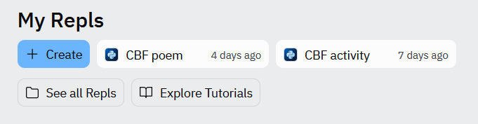

```{r setup, include=FALSE}
knitr::opts_chunk$set(echo = TRUE)
```

<br>

# Introduction

'Choose Your Own Adventure' books were extremely popular in the 1980s and 1990s. They were written in second person and presented the reader with a series of branching choices. After each section the reader would be prompted with a decision, followed by a 'turn to page x' or 'turn to page y'. Depending on what choices the reader made they might get a good ending or a bad ending (or a neutral one).

<br>

<center>


</center>

<br>

[This web page](https://www.atlasobscura.com/articles/cyoa-choose-your-own-adventure-maps) demonstrates the branching structure of some Choose Your Own Adventure books that were popular at the time. They would be in a variety genre but it was common to get Dungeons and Dragons-esque fantasy adventures (think Stranger Things!).

<br>

<center>


</center>

These books would go on to influence a generation of narrative video games including *Until Dawn*, *The Walking Dead Game*, *Heavy Rain*, *Creatures Such as We, Monster Prom, Oxenfree*, *Divinity Original Sin* and many more....

<br>

<center>


</center>

<br>

In this activity we are going to create our own Choose Your Own Adventure game coded in Python.

<br> <br>

# Let's play!

Our previous activities have introduced us to the `print` function and the `sleep` function. We are going to make use of both of these here. In addition to this, **we are going to create our own functions**. This might sound quite daunting but we will break the process down into steps.

Let's begin by creating a new repl, we might call it 'CBF game', but you can use whatever name you like.

<br>

<center>




</center>

<br>

Once you have created your repl paste the below code into main.py (the code box).

<br>

```{python, eval=FALSE}

# 'Start game' function
def start(): 
  print("Welcome to my 'choose your own adventure game'.")
  print("To play the game you will be given prompts on the terminal.")
  print("These prompts might ask you to enter text, or numbers to select certain actions..")
  print("Now, let's begin...")

  # Move onto 'choose name path'
  choose_name()


# Begin 'choose name path'
def choose_name():
  name = input("What is your name? ")
  print("Welcome " + name + "...")

  # Move onto 'wake up' path
  wake_up()


# Begin 'wake up' path
def wake_up():
  print("\nYou wake up in a cave.")
  print("It is dark and cold. \nYou don't know how you got there.")
  print("\nThere are two exits.")
  print("Down the LEFT exit you hear gentle voices. Down the RIGHT exit it is quiet.")
  
  answerSide = input("\nWhich way do you go? \n1. LEFT\n2. RIGHT\n")

  # If '1' for left is selected go onto 'game win' path
  if answerSide == "1": 
    game_win()

  # If '2' for right is selected go onto 'game lose' path
  elif answerSide == "2":
    game_lose()

  # If the player tries to enter other text tell them it isn't valid and begin 'wake up' path again
  else:
    print("Not a valid input. Try again and pick a number.")
    wake_up()


def game_win():
  print("\nThe left path is empty. Strangely empty. But you reach an exit. Well done, you win!")


def game_lose():
  print("\nThe gentle voices belong to a terrible monster with too many mouths. It spots you and eats you. Oh no, you lose!")
  

# After all the functions for the different paths are defined, the game actually begins to run here
# This runs the 'start game' function 
start()


```

<center>


</center>

<br>

Now click 'run', what happens?

...

A very simple Choose Your Own Adventure game plays out on screen. Let's break down this code so we can understand what is happening.

It begins with us defining a **function**:

```{python, eval=FALSE}

def start(): 
  print("Welcome to my 'choose your own adventure game'.")
  print("To play the game you will be given prompts on the terminal.")
  print("These prompts might ask you to enter text, or numbers to select certain actions..")
  print("Now, let's begin...")

  # Move onto 'choose name path'
  choose_name()

```

<br>

A function is a block of code that only runs if it is *called*. We use the keyword `def` to declare a function, then follow it up with the function name, in this case 'start'. Inside the brackets we can add parameters that modify the function but we won't go into this during this session. We end the line with a colon.

After that we begin a block of indented code underneath. These are statements that the function should execute. In this case we print several lines of text introducing the game. Then we call a function named `choose_name`. You might notice that `choose_name` isn't a function we've been introduced to yet. That is because we're going to define that function ourselves.

```{python, eval=FALSE}

# Begin 'choose name path'
def choose_name():
  name = input("What is your name? ")
  print("Welcome " + name + "...")

  # Move onto 'wake up' path
  wake_up()

```

<br>

Inside the function `choose_name` we use the function `input` that we outlined in [Activity 1](activity1.html). This causes some text to pop up, prompting the user for their name. The user input is stored in the variable 'name'.

The next line prints "Welcome" combined with the text stored in 'name', followed by some ellipses. After that it calls the function `wake_up`. By now you will have gathered that we are going to define `wake_up` ourselves.

`wake_up` is a little more complicated than our previous two functions in that it contains a **control statement.** It first prints the story text to set the scene for the player, then it asks them to make the choice '1. LEFT' or '2. RIGHT' using the `input` function. The output of this is stored in the variable 'answerSide'. This is where our branches then come in.

-   Our code first evaluates whether 'answerSide' equals "1". If it does it passes the user onto the `game_win` function.

-   If 'answerside' doesn't equal "1" it then evaluates whether it equals "2" instead. If it does, then it passes the user onto the `game_lose` function.

-   If 'answerSide' doesn't equal either of these things then we print a warning to the user that they need to pick a number and it would begin running the function from the beginning.

```{python}

# Begin 'wake up' path
def wake_up():
  print("\nYou wake up in a cave.")
  print("It is dark and cold. \nYou don't know how you got there.")
  print("\nThere are two exits.")
  print("Down the LEFT exit you hear gentle voices. Down the RIGHT exit it is quiet.")
  
  answerSide = input("\nWhich way do you go? \n1. LEFT\n2. RIGHT\n")

  # If '1' for left is selected go onto 'game win' path
  if answerSide == "1": 
    game_win()

  # If '2' for right is selected go onto 'game lose' path
  elif answerSide == "2":
    game_lose()

  # If the player tries to enter other text tell them it isn't valid and begin 'wake up' path again
  else:
    print("Not a valid input. Try again and pick a number.")
    wake_up()


```

<br>

Our final two functions are our `game_win` or `game_lose` functions. These just give an ending depending on which side was chosen.

<br>

To break it down, lines 1-49 are all just defining the functions that will be used to run the game. None of that code is intitially executed when the code is ran. You can think of this process as us writing invisible instructions before our script runs.

When the code reaches line 54 we call the function `start`. This executes all the code inside the `start` function we defined earlier. Then, depending on the player input, the other functions will be executed.

The way the functions link up represents the branching structure of a Choose Your Own Adventure Game.

<br>

<center>


</center>

<br> <br>

## Improve it!

One thing you may have noticed in some of the `print` statements is that they include `\n`. This means, move onto a new line. This is useful for spacing out the text, otherwise all of it might bunch together. This would look a bit ugly and be difficult to read. You can try to remove the `\n` parts and see what happens.

Another thing we could do to improve our game is by introducing pauses between lines. You might have predicted that we are going to use the `sleep` function from the package 'time' to do this, like we did in [Activity 2](activity2.html).

<b>Challenge: introduce pauses between the lines of text in our game. Play around with timings to make them most effective.</b>

If you're stuck/want an example, reveal the code in the box below. Remember we need to `import` the package 'sleep' first.

```{python, eval=FALSE, class.source = 'fold-hide'}

import time

def start(): 
  print("Welcome to my 'choose your own adventure game'.")
  print("To play the game you will be given prompts on the terminal.")
  print("These prompts might ask you to enter text, or numbers to select certain actions..")
  print("Now, let's begin...")

  # Move onto 'choose name path'
  choose_name()


def choose_name():
  name = input("What is your name? ")
  print("Welcome " + name + "...")

  wake_up()

def wake_up():
  print("\nYou wake up in a cave.")
  time.sleep(1)
  print("It is dark and cold. \nYou don't know how you got there.")
  time.sleep(1)
  print("\nThere are two exits.")
  time.sleep(1)
  print("Down the LEFT exit you hear gentle voices. Down the RIGHT exit it is quiet.")
  time.sleep(1)
  answerSide = input("\nWhich way do you go? \n1. LEFT\n2. RIGHT\n")

  if answerSide == "1": 
    game_win()

  elif answerSide == "2":
    game_lose()

  else:
    print("Not a valid input. Try again and pick a number.")
    wake_up()


def game_win():
  print("\nThe left path is empty.")
  time.sleep(1)
  print("Strangely empty.")
  time.sleep(1)
  print("But you reach an exit. Well done, you win!")


def game_lose():
  print("\nThe gentle voices belong to a terrible monster with too many mouths.")
  time.sleep(1)
  print("It spots you and eats you.")
  time.sleep(1)
  print(" Oh no, you lose!")
  

start()

```

Finally, you might have noticed our game just ends when the play gets the 'game win' or 'game lose' text. Most games provide the players with an option to play again or quit. We are going to improve our game by adding the option to do so.

We define an additional function called `play_again`.

```{python, eval=FALSE}

def play_again():
  print("")
  restart = input("Do you want to play again? (y/n))")
  if restart == "yes" or restart == "y":
    print("\n\n")
    start()
  elif restart == "no" or restart == "n":
    print("Okay, farewell!")
    quit()

```

<br>

This function asks the user if they want to play again using the `input` function and stores the answer in 'restart'.

-   If the answer was "yes" OR "y" several lines of empty space are printed before the `start` function is called and the game begins again.

-   If the answer was "no" OR "n" a goodbye message is printed and the code quits out.

(Note: in replit you will get a warning saying 'repl process died unexpectedly:', you can ignore this.)

<br>

To add the option to play again, we need to call our `play_again` function at the end of our `game_win` or `game_lose` functions. You can see the full code below:

```{python, eval=FALSE, class.source = 'fold-hide'}

import time

def start(): 
  print("Welcome to my 'choose your own adventure game'.")
  print("To play the game you will be given prompts on the terminal.")
  print("These prompts might ask you to enter text, or numbers to select certain actions..")
  print("Now, let's begin...")

  # Move onto 'choose name path'
  choose_name()


def choose_name():
  name = input("What is your name? ")
  print("Welcome " + name + "...")

  wake_up()

def wake_up():
  print("\nYou wake up in a cave.")
  time.sleep(1)
  print("It is dark and cold. \nYou don't know how you got there.")
  time.sleep(1)
  print("\nThere are two exits.")
  time.sleep(1)
  print("Down the LEFT exit you hear gentle voices. Down the RIGHT exit it is quiet.")
  time.sleep(1)
  answerSide = input("\nWhich way do you go? \n1. LEFT\n2. RIGHT\n")

  if answerSide == "1": 
    game_win()

  elif answerSide == "2":
    game_lose()

  else:
    print("Not a valid input. Try again and pick a number.")
    wake_up()


def game_win():
  print("\nThe left path is empty.")
  time.sleep(1)
  print("Strangely empty.")
  time.sleep(1)
  print("But you reach an exit. Well done, you win!")

  play_again()


def game_lose():
  print("\nThe gentle voices belong to a terrible monster with too many mouths.")
  time.sleep(1)
  print("It spots you and eats you.")
  time.sleep(1)
  print(" Oh no, you lose!")

  play_again()
  

def play_again():
  print("")
  restart = input("Do you want to play again? (y/n))")
  if restart == "yes" or restart == "y":
    print("\n\n")
    start()
  elif restart == "no" or restart == "n":
    print("Okay, farewell!")
    quit()

start()

```

<br>

The final structure of our game ends up being:

<br>

<center>


</center>

<br><br>

# Create your own game

Now, let's try and create our own game. At first, begin with the template from our first game and try to create a game with only one choice that leads to a 'win' or 'lose' situation.

After that, try to complicate your game by including multiple branches. Before trying to code this it would be good to draft out your branch structure so you can see how everything links together. We have provided pens and paper for you to create a draft for your game.

Try to create a diagram like the one above. Give each of your branches a name as these could become the function names (remember: no spaces in function names, if you want to use a space separate it with an underscore!).

<br><br>

# Conclusions

In this activity we have created our own 'choose your own adventure game'. We employed several difficult programming concepts including functions and control statements. You don't need to understand exactly how all of this code worked, but hopefully you can use this skeleton to keep developing your story if you want to.

We could make this game a lot more complicated by including items that could be encountered and change the outcome of certain branches, but this is beyond the scope of this session. There are many examples of Python 'choose your own adventure' games on the web that you could use for inspiration if you want to continue developing your own. [Here](https://replit.com/@worldsgreatestt/horror-game-in-python) is an example of a creative horror game hosted on replit.

If you create a game, please share your code/repl with me so I can try it! :) (I promise I won't read spoilers.) Contact me at [Emily.Johnson\@liverpool.ac.uk](mailto:Emily.Johnson@liverpool.ac.uk){.email} with the subject line 'Python Game' if you want me to take a look.

<br><br>


