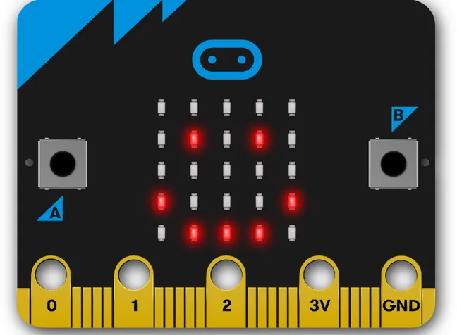
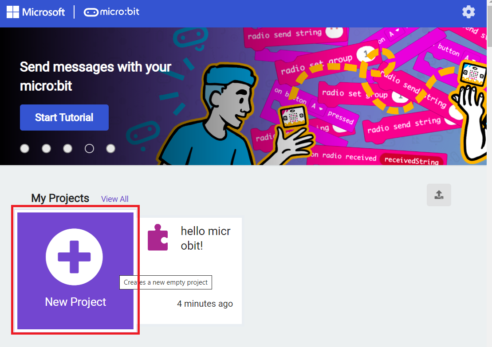
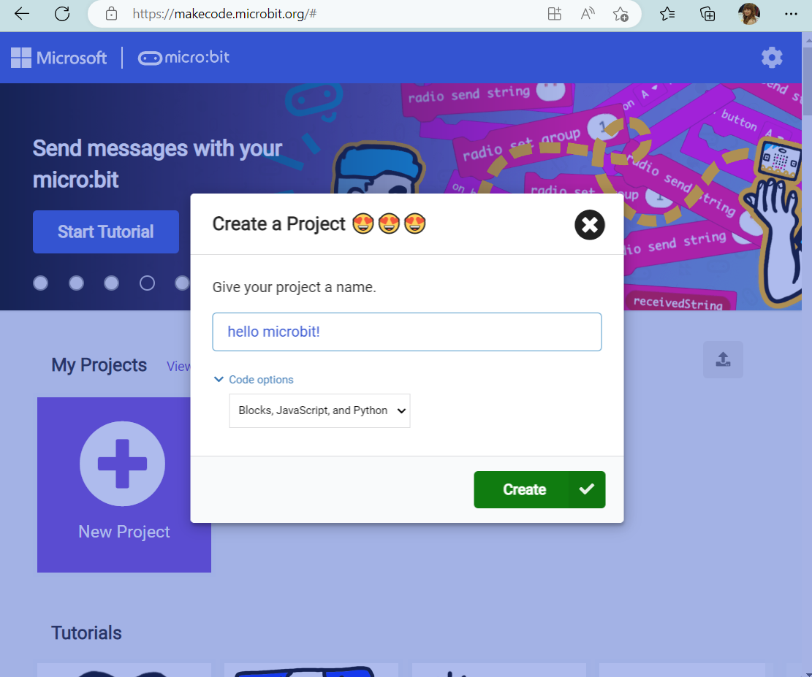
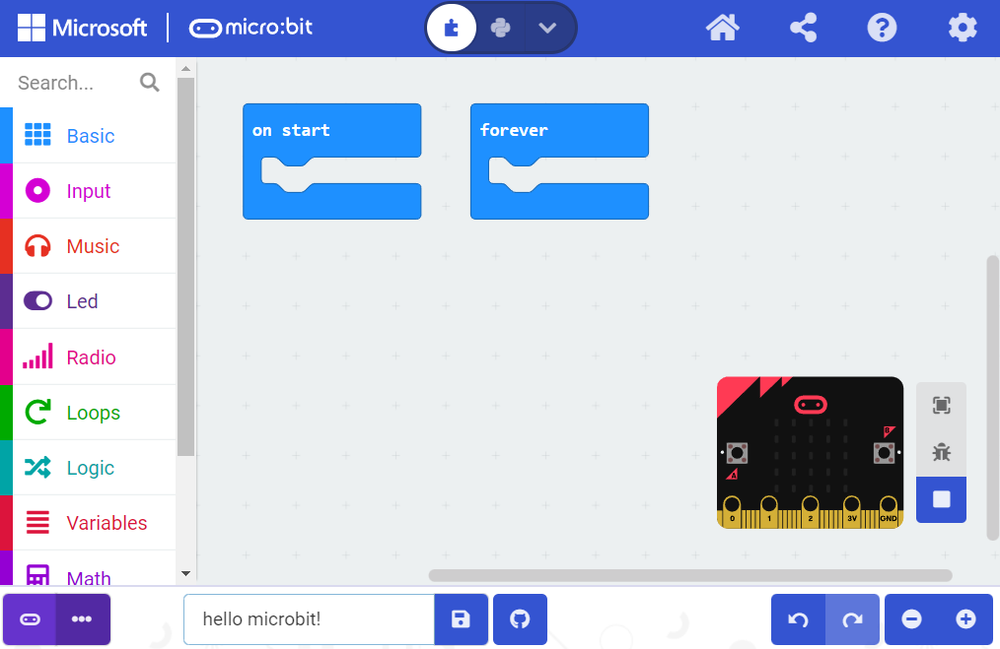
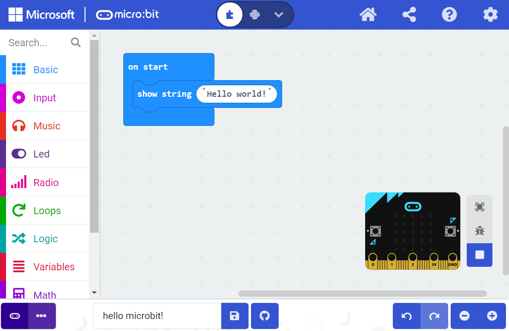
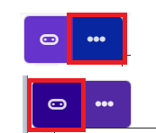
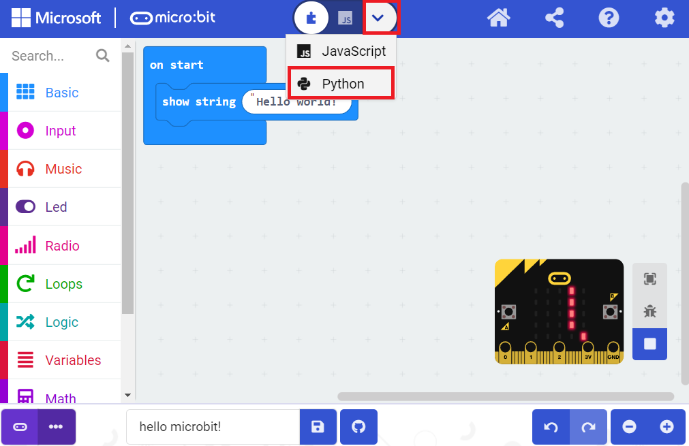
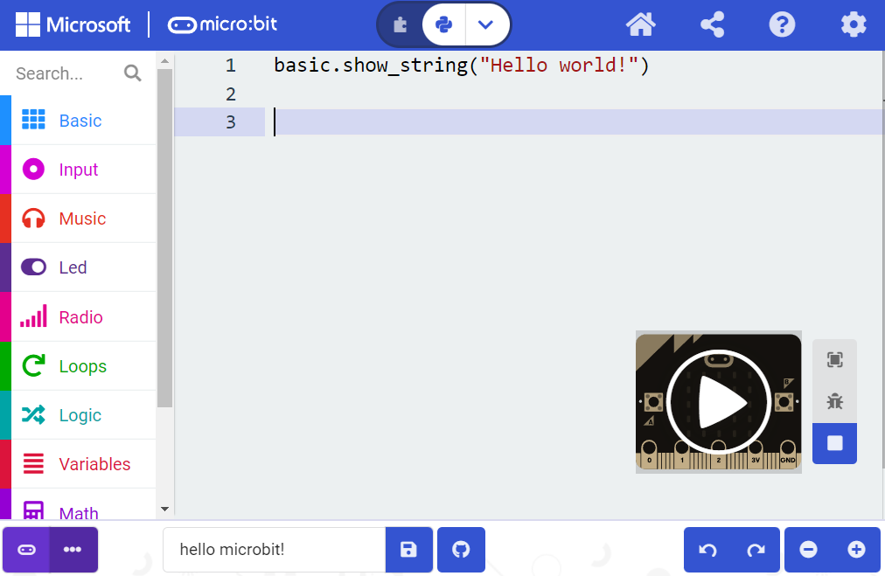
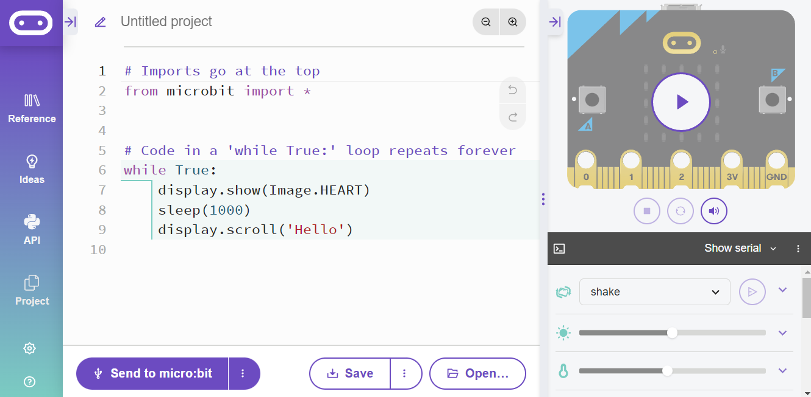

```{r setup, include=FALSE}
knitr::opts_chunk$set(echo = TRUE)
```

<br>

# Introduction

By now you'll have carried out activity 1 and activity 2 of the introductory python and possibly the LEGO activities too.

We are now going to use python to program a small computer known as a micro:bit.

<br>

<center>

{width="414"}

</center>

<br>

Despite it's small size the micro:bit is quite powerful. It has inbuilt speakers, a display, a compass,
accelerometer, radio and more! Because of this it can be used to create reasonably advanced Python programs.

<br><br>

# Hello micro:bit

## Make code

As is customary we begin with a 'hello world!' program to test out our micro:bit. This is mostly just to get you familiar with the micro:bit interface and how we transfer our program to the micro:bit.

To begin, we navigate to the MakeCode editor on the micro:bit website: <https://makecode.microbit.org/> .

It is important we use a browser compatible with the micro:bit. I'd recommend Microsoft Edge which we already have set up for you. On this page we then click 'New Project'. We can give our project any name we like but I'd suggest 'hello microbit!'.

<br>

<center>





</center>

<br>

We will be greeted by an interface that looks like this:

<br>

<center>



</center>

<br>

We can delete blocks by right clicking on them and pressing delete. I got rid of the forever block to keep things tidy. Then we can construct our program. An example 'hello world!' program is below:

<br>

<center>



</center>

<br>

When our program is ready we need to make sure our micro:bit is connected if it isn't already.

<br>

<center>



</center>

<br>

If you hover over the three dots in the bottom left it will tell you if you're already connected. If not, click them and it will give you the option to connect. When you're ready to 'flash' your program to the micro:bit click the button with the micro:bit logo. If you hover over it it will say 'download your code to the micro:bit'. After you click it you should see 'hello world!' start to scroll across the LED interface.

<br><br>

## Python

Now, let's convert that to python. There are two ways we could approach this. Inside the MakeCode editor there is the option to automatically convert your blocks into python. If you click the drop down arrow, followed by 'python' the python equivalent of your program will appear. This can be really useful for drafting out ideas and understanding certain programming concepts!

Once again to run the code we click the button in the bottom left to send it to our micro:bit.

<br>

<center>





</center>

<br>

The other option is to use the Python editor on the micro:bit website: <https://python.microbit.org/v/3>. If you open this link you'll see a page that looks like this:

<br>

<center>



</center>

<br>

This has a few advantages compared to the python contained in the [MakeCode editor](https://support.microbit.org/support/solutions/articles/19000111744-makecode-python-and-micropython). This includes a very detailed reference manual on the side bar along with an 'ideas' tab. The version of python it contains is also more similar to what we use in the LEGO robots and replit. For this reason I'd recommend using the python editor to write your python code.

*However*, the functions to program our micro:bit are different in this version. In the MakeCode editor the python code is:

```{python, eval=FALSE}

basic.show_string("Hello world!")
      
```

<br>

In the python editor it is:

```{python, eval=FALSE}

# Imports go at the top
from micro:bit import *


# Program goes here
display.scroll('Hello world!')


```

You can see we have to include an import statement to import all the micro:bit functions. In the remaining activities the python code provided will only be for the micro:bit python editor to avoid confusion.

Note: you can't use the MakeCode editor and Python editor at the same time, close one to use the other.

<b>Challenge: modify the above code to contain a phrase of your choice instead. It could be your name, or your school's name.</b>

<br><br>

# Summary

We have created a basic 'hello world!' program in the MakeCode editor and Python editor. We have learned the difference between the two versions of Python available for the micro:bit and why we should use the Python editor.

If you have already carried out the LEGO activities and you're feeling a little more confident you're welcome to browse the activities on the micro:bit website and try to code them either in MakeCode or Python editor (or preferably both!).

A list of sample activities suitable for python programming are provided by the makers of the micro:bit and can be found here: <https://microbit.org/projects/make-it-code-it/?filters=python>

<br> <br>


