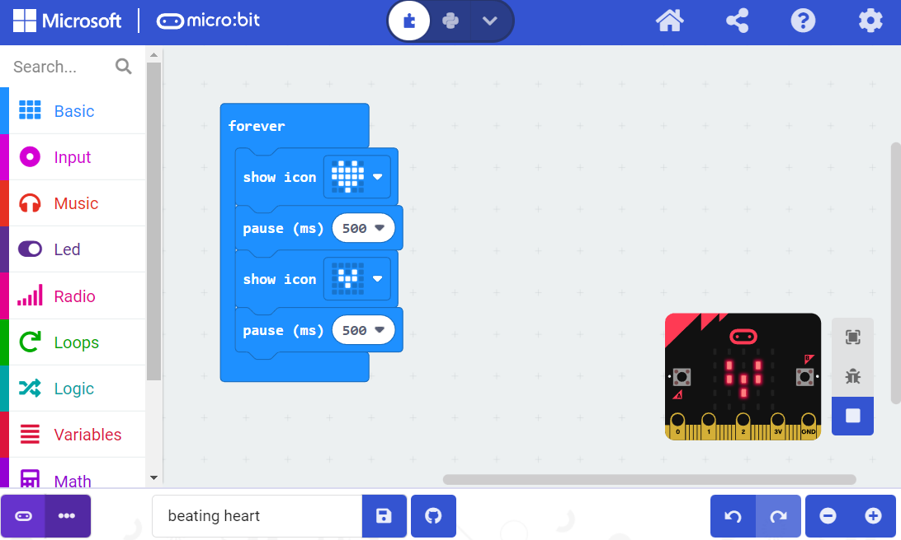
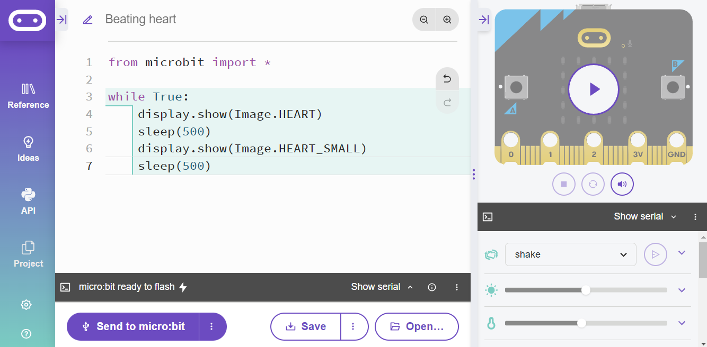
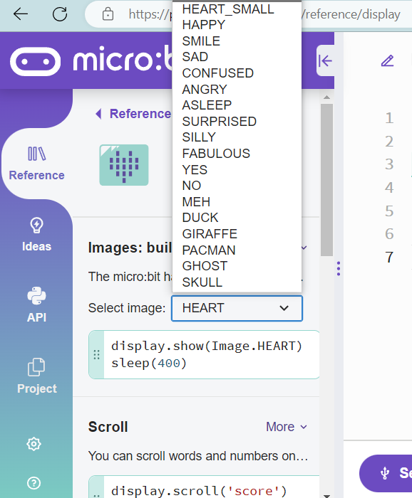
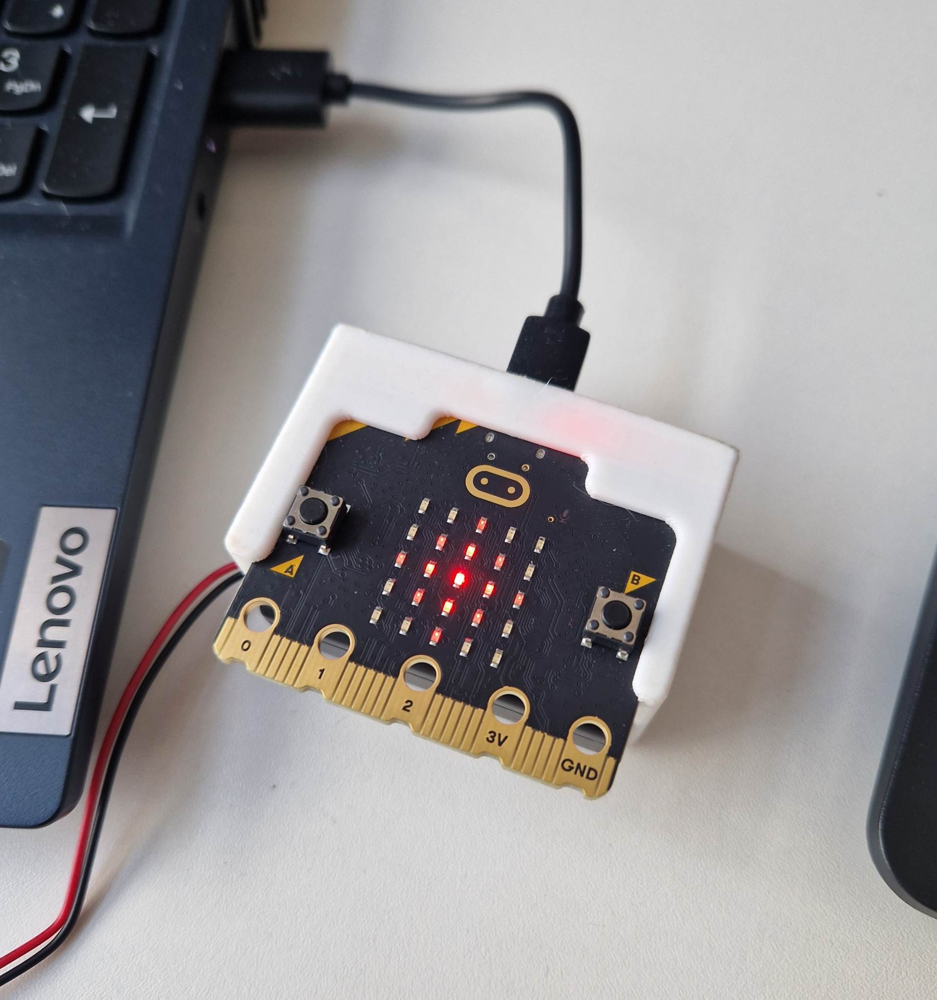

```{r setup, include=FALSE}
knitr::opts_chunk$set(echo = TRUE)
```

<br>

# Introduction

In this activity we are going to create a beating heart animation on the LED display. This program will loop infinitely.

<br><br>

# Beating heart

## Make code

Open the [MakeCode editor](https://makecode.microbit.org/#editor). The program is below:

<br>

<center>



</center>

<br>

Run the above program and see what happens. You should see a heart that appears to 'beat' as it shrinks and expands.

The way it works is by cycling between two images: a big heart and a small heart. When the image is displayed the next code block introduces a small delay (half a second, i.e. 500 milliseconds). Without this the program would loop through the two images so fast it would appear as if the big heart was just flickering. In animation we would consider each image a separate frame - pacing the frames is an important concept in animation.

The 'forever' block is the equivalent of a forever *while loop* in [python](mindstorm4.html). This keeps the loop going forever.

**Challenge: try and create your own animation. You could use the premade icons using the 'show icon' block or create your own icon using the 'show leds' block. Try and use more than two frames, play around with the pauses between the frames.**

<br><br>

## Python

Open the [Python editor](https://python.microbit.org/v/3). We are now going to create the above program in python instead.If you completed the earlier [motors and movement](mindstorm4.html) LEGO robot activity you'll have already been introduced to the idea loops and iteration. One type of loop is called a *while loop*. We can create a while loop that will repeat until a certain condition is met or one that repeats forever. The below code will cause our program to repeat forever (or until our microbit is unplugged).

<br>

<center>



</center>

```{python, eval=FALSE, class.source = 'fold-hide'}

from microbit import *

while True:
    display.show(Image.HEART)
    sleep(500)
    display.show(Image.HEART_SMALL)
    sleep(500)

```

<br>

We use the `display.show()` function to display an image. Micro:bit has a number of built-in images. If you look in the reference manual under 'Reference \> display \> Images: built-in' you can see what images are available.

<center>

{width="518"}

</center>

<br><br>

We can also create our own custom images in the python editor using the `display.show()` function. Each number represents the intensity of the light on the 5x5 matrix. '0' means the light is off. '9' is the brightest.

```{python, eval=FALSE}

from microbit import *

display.show(Image('00300:'
                   '03630:'
                   '36963:'
                   '03630:'
                   '00300'))

```

<br>

The code above results in a diamond that gets brighter the closer it is to the center:

<br>

<center>

{width="399"}

</center>

<br>

<b>Challenge: can you recreate the animation you made in the MakeCode editor using python? Can you create an image with pixels of varying light intensity.</b>

<br><br>

# Summary

In this activity we have:

-   Used the light matrix to create images

-   Used *forever* code blocks and *while loops* to create looping animations

<br> <br>


