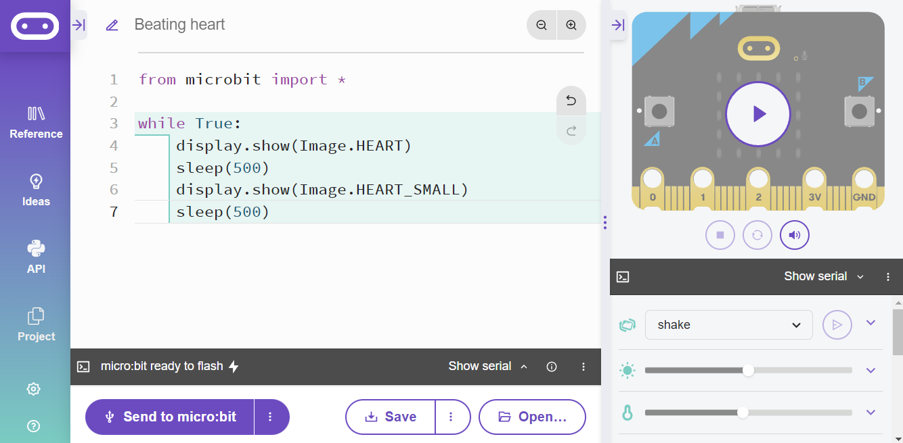

```{r setup, include=FALSE}
knitr::opts_chunk$set(echo = TRUE)
```

<br>

# Introduction

In this activity we are going to create a dice roller. When our micro:bit is shaken it will display a number between 1 and 6. We will then improve it by making the display look like the pips on a dice.

<br>

<center>

{width="512"}

</center>

<br><br>

# Dice roller

## Make code

Open the [MakeCode editor](https://makecode.microbit.org/#editor). The program is below:

<br>

<center>


</center>

<br>

text text

<br><br>

## Python

Open the [Python editor](https://python.microbit.org/v/3).

<br>

<center>



</center>

```{python, eval=FALSE, class.source = 'fold-hide'}

from microbit import *

while True:
    display.show(Image.HEART)
    sleep(500)
    display.show(Image.HEART_SMALL)
    sleep(500)

```

<br>

<br><br>

# Summary

In this activity we have:

-   Used the light matrix to create images

-   Used *forever* code blocks and *while loops* to create looping animations

<br> <br>


