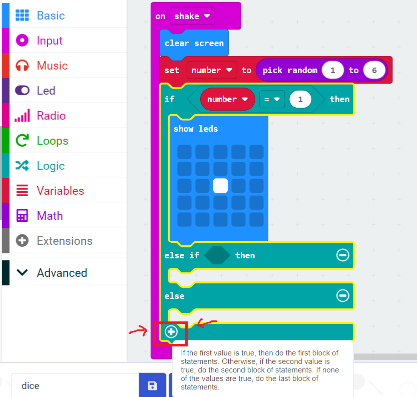

```{r setup, include=FALSE}
knitr::opts_chunk$set(echo = TRUE)
```

<br>

# Introduction

In this activity we are going to create a dice roller. When our micro:bit is shaken it will display a number between 1 and 6. We will then improve it by making the display look like the pips on a dice.

<br>

<center>

{width="512"}

</center>

<br><br>

# Dice roller

## Make code

Open the [MakeCode editor](https://makecode.microbit.org/#editor). The program is below:

<br>

<center>


</center>

<br>

Our micro:bit contains an accelerometer which means it can detect movement. In this program when the micro:bit is shaken it activates the 'when shaken' block. Inside that block is the 'show number' block.

To make it show a random number we have to scroll down to the 'math' section of blocks and then drag the 'pick random' block inside where the number would be. We can select any range we like for the numbers but since we are trying to emulate a 6 sided dice we say 1-6.

When you run this program it may be easier to then unplug the micro:bit from the laptop and connect the battery pack as so to make the micro:bit easier to shake:

<br>

<center>


</center>

<br><br>

### Improve it!

Whilst some 6-sided dice display numerals on each face, most instead show pips:

<br>

<center>


</center>

<br>

We are now going to modify our program so it shows pips instead.

Like before the accelerometer detects when the micro:bit has been shaken. It then generates a random number. Instead of displaying that number on screen it saves the number inside a 'variable' and passes the variable to a big 'else if' block. Inside that block the number is evaluated, essentially saying 'if the number is x, show x, otherwise if the number is y show y, otherwise.....'.

The full program is further below. But to begin, we need to create a variable for 'number'. We do so by clicking on 'variables', then 'make a variable':

<br>

<center>


</center>

<br>

This then gives you some new blocks to work with. We can drag the 'pick random' block inside the 'set number' block as we did earlier for the 'show number' block.

We then build up program using the logic blocks. We can find the blocks we need under 'conditionals' and 'comparison':

<br>

<center>




</center>

<br>

Here is the final program:

<br>

<center>

{width="417"}

</center>

<br>

<b>Challenge:

-   Can you make the display clear after a few seconds to save battery?

-   Can you make your dice display different numbers? Can you think of a way to represent numbers greater than 6 with pips? (Or some other notation?)</b>

<br><br>

## Python

Now let's convert our program into python! Open the [Python editor](https://python.microbit.org/v/3).

This program will have the same outcome as the one above and works off the same logic. We need to import a python package 'random' to let us use random numbers though. The program is below:

<br>

<center>


</center>

```{python, eval=FALSE, class.source = 'fold-hide'}

from microbit import *
import random

while True:
    if accelerometer.was_gesture('shake'):
        display.show(random.randint(1, 6))
```

<br>

By now you'll hopefully be more familiar with the idea of using forever while loops to keep a program repeating. Inside the while loop we use a condition that asks whether the accelerometer detected shaking (line 5).

If the accelerometer detected shaking it then moves onto line 6. This uses the `display.show()` function to display something on screen. Inside the brackets we say what we want to display (be it a number or phrase or something else). In this case we use the `randint()` function inside 'random' to generate a random number between 1 and 6.

If you were to run the following inside replit for example:

```{python}

import random

print(random.randint(1,6))

```

You would see the output of `random.randint(1,6)` is just a number between 1 and 6. If our random number was 4 we'd essentially be running:

`display.show(4)`.

So the code essentially substitutes a random number between 1 and 6 inside `display.show()` each time we shake the micro:bit.

<br><br>

### Improve it!

Next, let's create the version with pips instead of numerals as we did in the MakeCode editor above. The full program is below. It is a bit too long to display on one screen so we have cropped it but included the code in a box below it.

<br>

<center>


</center>

```{python, eval=FALSE, class.source = 'fold-hide'}

from microbit import *
import random

while True:
    if accelerometer.was_gesture('shake'):
        number = random.randint(1, 6)
        if number == 1:
            display.show(Image(
            "00000:"
            "00000:"
            "00900:"
            "00000:"
            "00000"))
        elif number == 2:
            display.show(Image(
            "00000:"
            "00000:"
            "90009:"
            "00000:"
            "00000"))
        elif number == 3:
            display.show(Image(
            "00009:"
            "00000:"
            "00900:"
            "00000:"
            "90000"))
        elif number == 4:
            display.show(Image(
            "90009:"
            "00000:"
            "00000:"
            "00000:"
            "90009"))
        elif number == 5:
            display.show(Image(
            "90009:"
            "00000:"
            "00900:"
            "00000:"
            "90009"))
        else:
            display.show(Image(
            "90009:"
            "00000:"
            "90009:"
            "00000:"
            "90009"))
            
```

<br>

This code starts off the same as the more simple version above. Then on line 6 it instead generates and saves the random number inside a variable called number. This is essentially the same as the 'set number to pick random between 1 and 6' block we used in the MakeCode editor above.

Then, on line 7, an elseif loop begins. Can you see that is nearly the same as our logic conditional block from earlier? It follows the same process of asking 'is the random number x, if so display this, is the random number y, if so display this...'.

The below code would show the dice face with 1 pip:

    display.show(Image(

                "00000:"

                "00000:"

                "00900:"

                "00000:"

                "00000"))
                

We learned about creating images in the [previous activity](microbit3.html) if you're unsure how this works. But essentially on the 5x5 light up screen the 0 mean don't light up, and the 9 means the brightest light setting.

<b>Challenge: try and play with the brightness levels of the pips on your dice. Try and create a dice that goes past 6. </b>

<br><br>

# Summary

In this activity we have:

-   Used the light matrix to create numbers and images

-   Made use of the accelerometer

-   Used more complicated while loops in combination with elseif loops

<br> <br>


