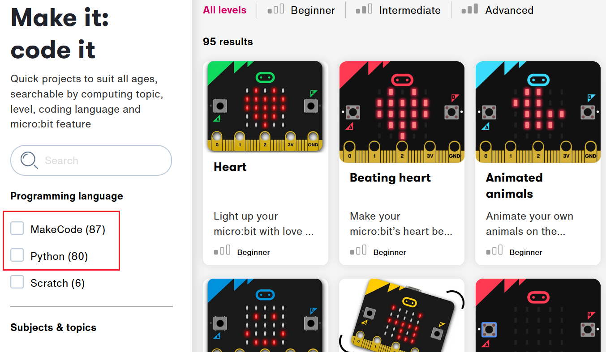

```{r setup, include=FALSE}
knitr::opts_chunk$set(echo = TRUE)
```

If you have finished all the available material and still have time you can browse the [micro:bit website](https://microbit.org/projects/make-it-code-it/) for more challenges.

The projects page (<https://microbit.org/projects/make-it-code-it/>) has all sorts of additional ideas. You can filter these to find projects that are available in both MakeCode and Python if you want to continue translating blocks into code!

<br>

<center>



</center>

<br>

