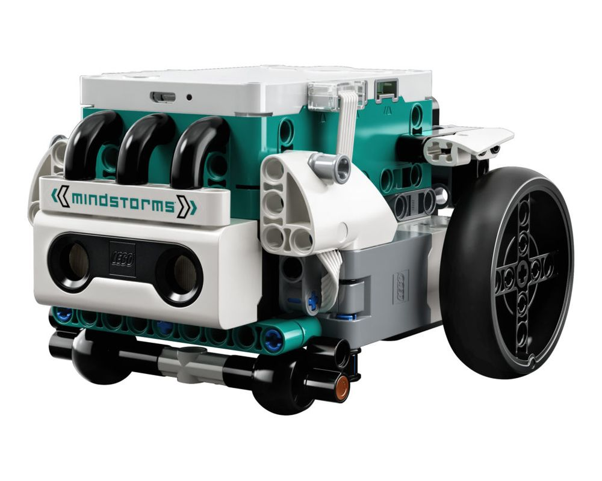
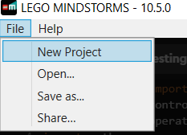
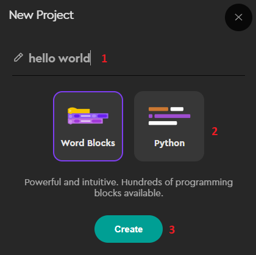
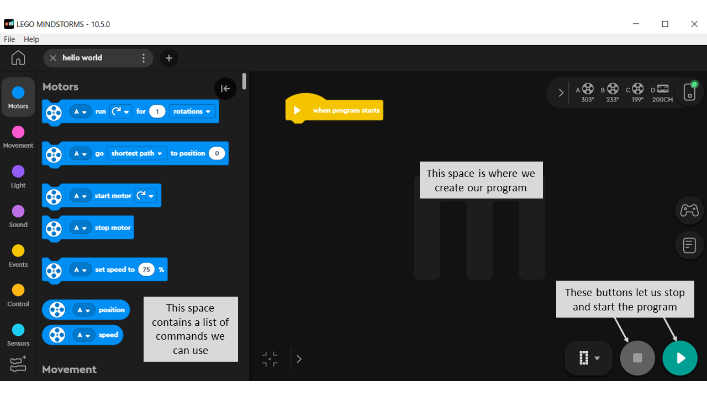
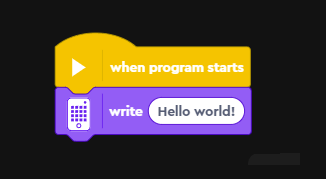
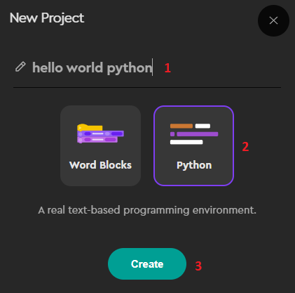
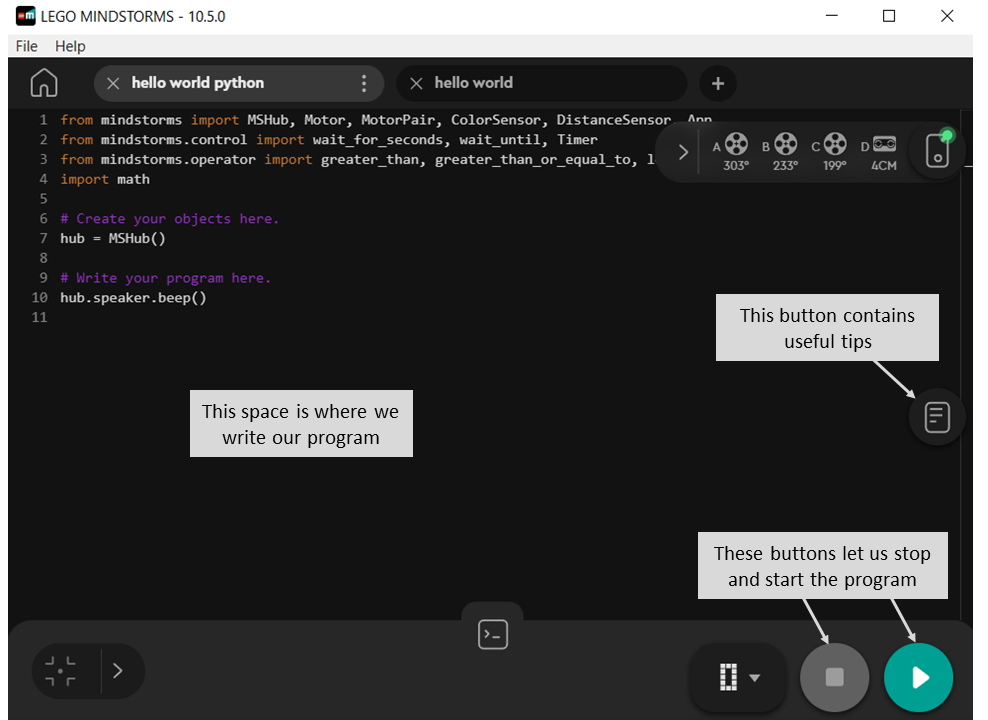
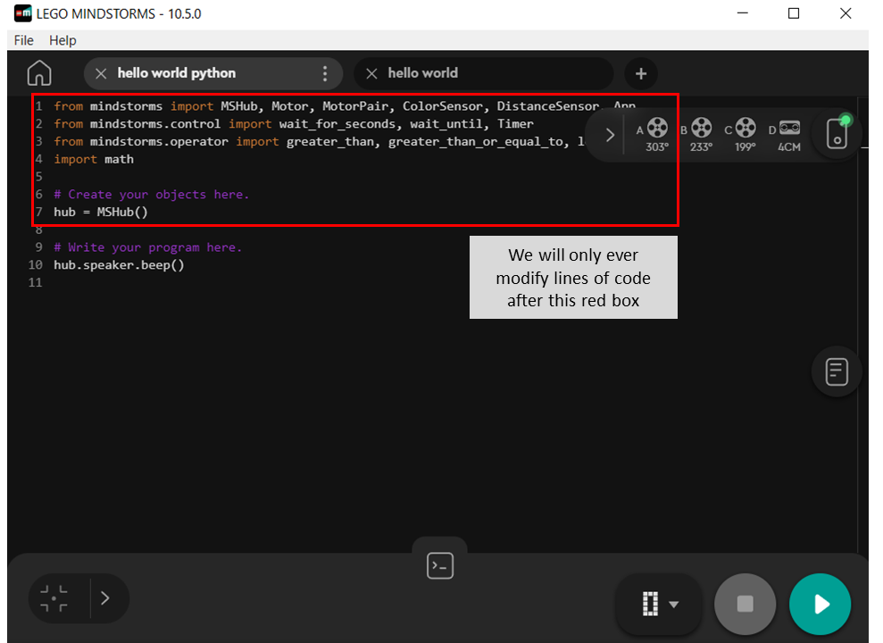

```{r setup, include=FALSE}
knitr::opts_chunk$set(echo = TRUE)
```

<br>

# Introduction

Our other activities have hopefully built up some familiarity with Python and the idea of text based programming. We are now going to use Python to help us program LEGO Robots!

The LEGO robot model used in this activity is the LEGO® MINDSTORMS® Robot Inventor. These robots can be built in several different ways. Ours looks like this:

<br>

<center>

{width="587"}

</center>

<br>

You may have used a block based programming language like Scratch before, or some equivalent. LEGO has it's own equivalent called 'word blocks'. In these activities we are first going to create our program using the word blocks, then translate those word blocks into Python.

<br><br>

# Hello LEGO!

In activity 1 you will have created a 'hello world!' script. We are now going to create something similar but with our LEGO robot instead.

The script will:

-   Make the screen on the robot light up and scroll through the worlds 'Hello world'.

<br><br>

## Word blocks

Firstly, let's create the word block version of our code. LEGO has an app we can use to create and run our code in.

We already have this app open for you but it is called 'LEGO MINDSTORMS 10.5.0'.

<br>

We create a new project by going to file \> New project :

<br>

<center>



</center>

<br>

Then we create a word block project. We can call it anything we like but I'd suggest 'hello world'. We need to make sure we select 'word blocks', then click create.

<br>

<center>



</center>

<br>

This will then bring up an interface which looks like this:



On the left we need to scroll down until we find the 'write' word block. We then edit the text inside the word block to say 'Hello world!'.

<br>

<center>



</center>

When our program is ready we press the 'play' button in the bottom right. Once we're finished/we want to make any modifications to it we then press the 'stop' button in the bottom right.

<b>Challenge: modify your word block to make the screen say something else instead. For example I might put 'Hello Emily!'</b>

<br><br>

## Python

Now we are going to go through the same process but with Python instead. Once again we need to click file \> New project.

This time though, we select python instead of word blocks:

<br>

<center>



</center>

<br>

This will bring up an interface that looks like this:

<center>



</center>

<br>

text text

<center>



</center>

<br> <br>


