```{r setup, include=FALSE}
knitr::opts_chunk$set(echo = TRUE)
```

<br>

# Introduction

In the first activity we used the word blocks and python to write a message on the light up screen. Next we are going to program the robot's speakers.

Like the previous activity we'll first create the code using word blocks, then translate into python.

<br> <br>

# Play a beep

## Word blocks

We'll start with a very basic program, just making our hub play a single sound.

Open a new project, select word blocks and then make the following program:

<br>

<center>

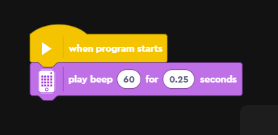

</center>

<br>

Not massively interesting so far but we'll get there!

<br><br>

## Python

Now we're going to write that same program in python.

As in the first activity we create a new project and select python, remember we can ignore the first 7 lines of code.

Next, we're going to edit line 10 to contain our program. The code is below (you can click the 'code' buttons to reveal the text if you want to copy and paste it throughout this page):

<br>

<center>

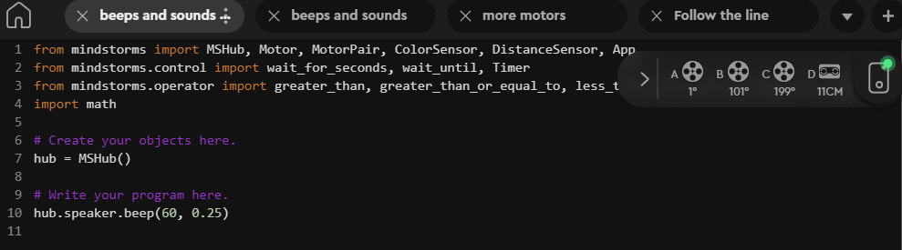

</center>

```{python, eval=FALSE, class.source = 'fold-hide'}

from mindstorms import MSHub, Motor, MotorPair, ColorSensor, DistanceSensor, App
from mindstorms.control import wait_for_seconds, wait_until, Timer
from mindstorms.operator import greater_than, greater_than_or_equal_to, less_than, less_than_or_equal_to, equal_to, not_equal_to
import math

# Create your objects here.
hub = MSHub()

# Write your program here.
hub.speaker.beep(60, 0.25)

```

<br>

In the previous activity we accessed the 'light_matrix' within 'hub'. This time it is the speaker. The speaker has a 'beep' function and then we pass it two arguments: the tone and the length of the tone (in seconds). When you execute this code it does the same as the word blocks above.

<b>Challenge: try playing around with different numbers for the tone and the length. </b>

(Hint: the tone can be any number between 44 and 123. What happens what you use a number outside of this range?)

We can also pass an optional third argument to the 'beep' function to control the volume. Try running the below code as an example:

<center>

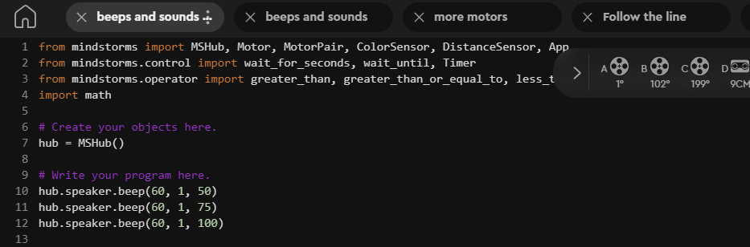

</center>

```{python, eval=FALSE, class.source = 'fold-hide'}


from mindstorms import MSHub, Motor, MotorPair, ColorSensor, DistanceSensor, App
from mindstorms.control import wait_for_seconds, wait_until, Timer
from mindstorms.operator import greater_than, greater_than_or_equal_to, less_than, less_than_or_equal_to, equal_to, not_equal_to
import math

# Create your objects here.
hub = MSHub()

# Write your program here.
hub.speaker.beep(60, 1, 50)
hub.speaker.beep(60, 1, 75)
hub.speaker.beep(60, 1, 100)


```

<br> <br>

# Play a sound

As well as being able to beep in different tones, the hub also comes with lots of inbuilt sounds you can use. If we scroll down to the sound work blocks there is a block that says 'play sound \<x\> until done'.

<br>

<center>

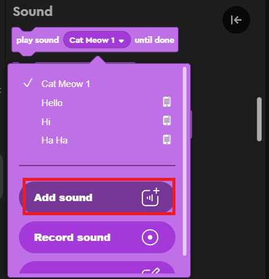

</center>

<br>

If you click 'add sound' you can see all the sounds that are available on the hub. Let's create a simple program that plays three different sounds sequentially:

<br>

<center>

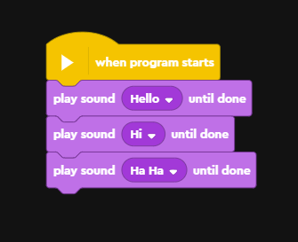

</center>

<br>

You might notice there is another sound block called 'start sound \<x\>'. What happens if you use this instead?

<br>

Now let's translate the above code into python again.

<br>

<center>

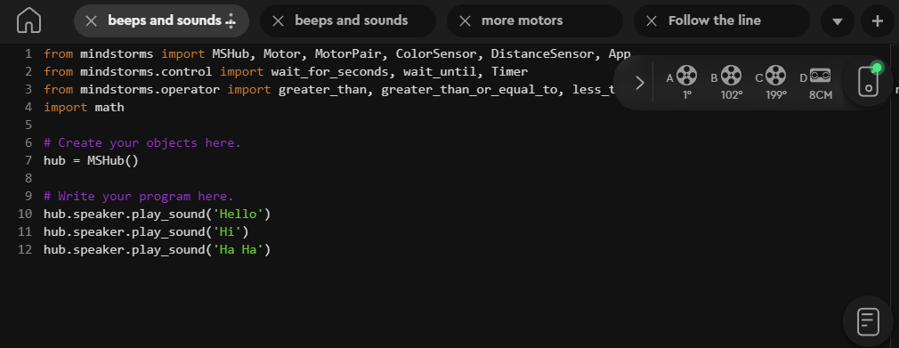

</center>

```{python, eval=FALSE, class.source = 'fold-hide'}

from mindstorms import MSHub, Motor, MotorPair, ColorSensor, DistanceSensor, App
from mindstorms.control import wait_for_seconds, wait_until, Timer
from mindstorms.operator import greater_than, greater_than_or_equal_to, less_than, less_than_or_equal_to, equal_to, not_equal_to
import math

# Create your objects here.
hub = MSHub()

# Write your program here.
hub.speaker.play_sound('Hello')
hub.speaker.play_sound('Hi')
hub.speaker.play_sound('Ha Ha')

```

You might wonder how you'd get the name of the sound without first creating this program with word blocks. We can do this by looking on the manual page of 'play_sound'. We access the manual by clicking the button on the right, then clicking 'python'. This will bring up a manual for all the lego python commands. We have to scroll down until we see the title 'Hub' then click 'Speaker'. After this you click 'play_sound()' and it will bring up information about that command. A full list of the sounds is included on this page.

<br>

<center>

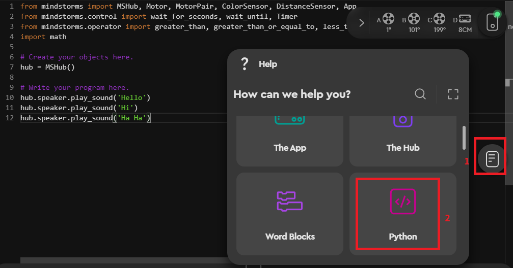

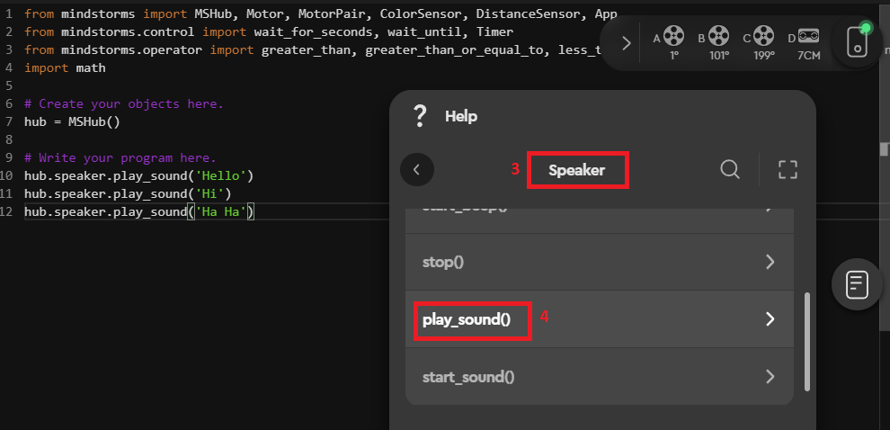

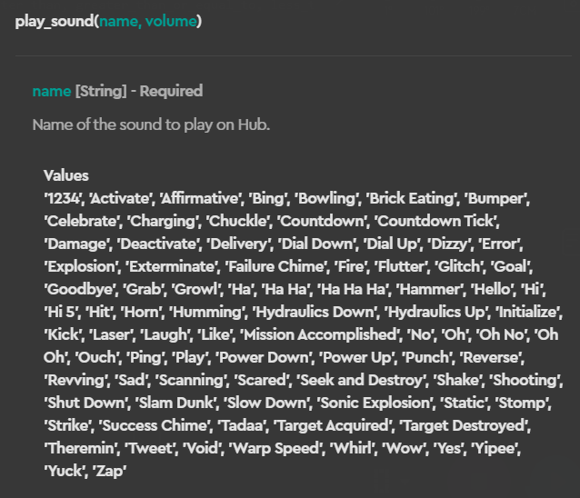

</center>

<br>

The manual will contain information and example python code for nearly all of the word blocks so is useful for translating between the two.

<br><br>

# Play a tune

## Word blocks

We're now going to create a short and simple tune using our LEGO word blocks. When we find the block 'play beep' and click on the tone it brings up a little keyboard for us to look at. Tone 60 actually corresponds to middle C on a piano.

<center>

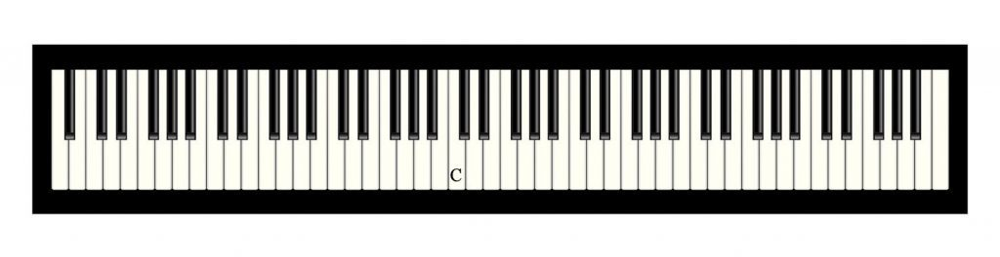

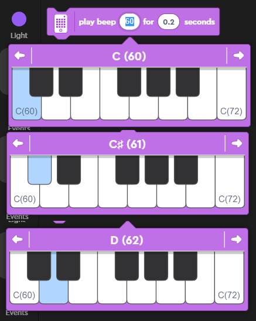

</center>

<br>

As we go up or down in tone you can imagine we're going up or down on a piano.

We are now going to write a program that plays a simple tune for us:

<br>

<center>

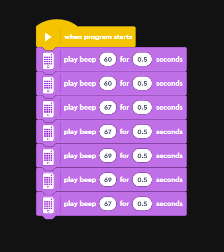

</center>

<br>

(It might sound faintly familiar - these are the first few notes of 'twinkle twinkle little star'!)

If we wanted to we could make the tune repeat using the 'repeat' word block:

<br>

<center>

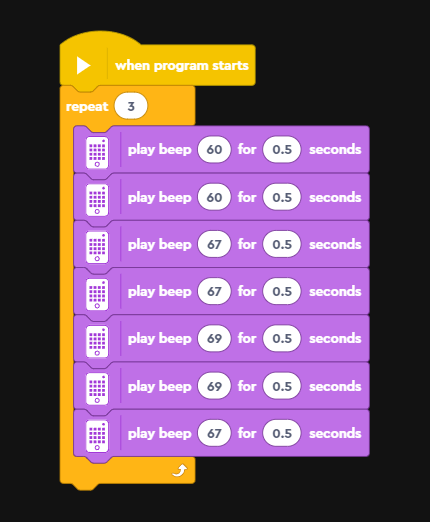

</center>

<br>

<b>Challenge: create a tune using the word blocks. Now make it repeat as many times as you like. </b>

<br><br>

## Python

Now let's translate those above code blocks into python. We showed earlier how you can use the 'hub.speaker.beep()' function to play tones. The code to play our above word blocks would be:

<br>

<center>

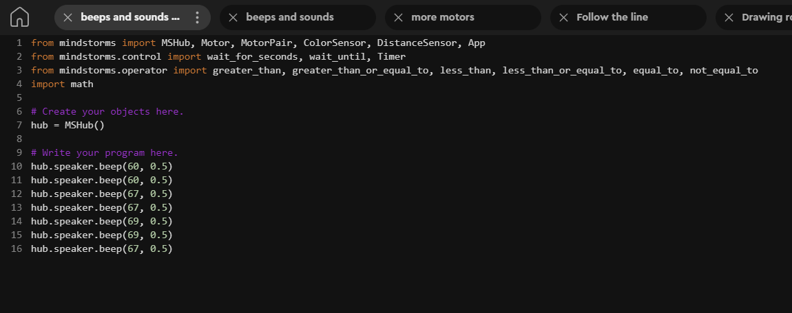

</center>

```{python, eval=FALSE, class.source = 'fold-hide'}

from mindstorms import MSHub, Motor, MotorPair, ColorSensor, DistanceSensor, App
from mindstorms.control import wait_for_seconds, wait_until, Timer
from mindstorms.operator import greater_than, greater_than_or_equal_to, less_than, less_than_or_equal_to, equal_to, not_equal_to
import math

# Create your objects here.
hub = MSHub()

# Write your program here.
hub.speaker.beep(60, 0.5)
hub.speaker.beep(60, 0.5)
hub.speaker.beep(67, 0.5)
hub.speaker.beep(67, 0.5)
hub.speaker.beep(69, 0.5)
hub.speaker.beep(69, 0.5)
hub.speaker.beep(67, 0.5)

```

We made our word block program more complicated by getting it to repeat three times. We could do that in python by pasting the code three times:

```{python, eval=FALSE}

# Write your program here.
#1
hub.speaker.beep(60, 0.5)
hub.speaker.beep(60, 0.5)
hub.speaker.beep(67, 0.5)
hub.speaker.beep(67, 0.5)
hub.speaker.beep(69, 0.5)
hub.speaker.beep(69, 0.5)
hub.speaker.beep(67, 0.5)

#2
hub.speaker.beep(60, 0.5)
hub.speaker.beep(60, 0.5)
hub.speaker.beep(67, 0.5)
hub.speaker.beep(67, 0.5)
hub.speaker.beep(69, 0.5)
hub.speaker.beep(69, 0.5)
hub.speaker.beep(67, 0.5)

#3
hub.speaker.beep(60, 0.5)
hub.speaker.beep(60, 0.5)
hub.speaker.beep(67, 0.5)
hub.speaker.beep(67, 0.5)
hub.speaker.beep(69, 0.5)
hub.speaker.beep(69, 0.5)
hub.speaker.beep(67, 0.5)


```

<br>

But this requires a lot of typing/space to do so!

In programming we can 'loop' through the same piece of code over and over again. In python we can use what is known as a <i>'for loop'</i> to loop through something a set number of times, using the following format:


```{python, eval=FALSE}

for i in range(NUMBER OF REPEATS):
  code.you.want.to.repeat

```

<br>

We provide python a range in the form of a number. Then the code we want to repeat. So for example, if we were to go back in replit and paste this code, we'd print 'hello world!' 4 times (you can try this if you want).

```{python}

for i in range(4):
  print("hello world!")

```

<br>

Now let's apply that to our LEGO robot program. Here we specify three loops...

<br>

<center>

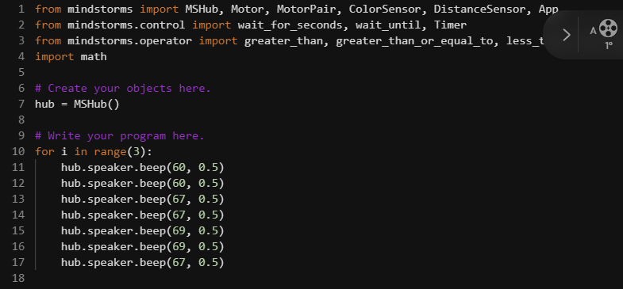

</center>

```{python, eval=FALSE, class.source = 'fold-hide'}

from mindstorms import MSHub, Motor, MotorPair, ColorSensor, DistanceSensor, App
from mindstorms.control import wait_for_seconds, wait_until, Timer
from mindstorms.operator import greater_than, greater_than_or_equal_to, less_than, less_than_or_equal_to, equal_to, not_equal_to
import math

# Create your objects here.
hub = MSHub()

# Write your program here.
for i in range(3):
    hub.speaker.beep(60, 0.5)
    hub.speaker.beep(60, 0.5)
    hub.speaker.beep(67, 0.5)
    hub.speaker.beep(67, 0.5)
    hub.speaker.beep(69, 0.5)
    hub.speaker.beep(69, 0.5)
    hub.speaker.beep(67, 0.5)


```

<br> The code now loops through our tune three times.

<b>Challenge: earlier you created your own tune. Can you recreate that tune in python? Can you loop it?</b>

<br><br>

### Bonus activity

Do you remember in the earlier [poetry activity](activity2.html) we used the python package 'time' to cause a delay between the lines of our poem? I mentioned this can be useful in applications such as game development but we can also use that package to help us program our robot.

An example of the code to do this is below:

<center>

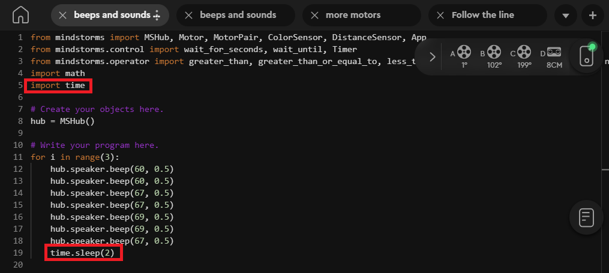

</center>

```{python, eval=FALSE, class.source = 'fold-hide'}

from mindstorms import MSHub, Motor, MotorPair, ColorSensor, DistanceSensor, App
from mindstorms.control import wait_for_seconds, wait_until, Timer
from mindstorms.operator import greater_than, greater_than_or_equal_to, less_than, less_than_or_equal_to, equal_to, not_equal_to
import math
import time

# Create your objects here.
hub = MSHub()

# Write your program here.
for i in range(3):
    hub.speaker.beep(60, 0.5)
    hub.speaker.beep(60, 0.5)
    hub.speaker.beep(67, 0.5)
    hub.speaker.beep(67, 0.5)
    hub.speaker.beep(69, 0.5)
    hub.speaker.beep(69, 0.5)
    hub.speaker.beep(67, 0.5)
    time.sleep(2) 

```

We've made two notable changes to the code. On line 5 it now imports the package 'time' so we can use the `sleep` function. Then on line 19 we use `time.sleep(2)` to add a two second pause to our program.

What this code does is:

-   Import our packages (including time)

-   Initialise the hub

-   Begin a three replicate loop. Inside each loop it:

    -   Plays seven notes sequentially for 0.5 seconds using `hub.speaker.beep`

    -   Pauses for two seconds using `time.sleep`

-   After the three loops the program is finished

If you have time, why don't you try modifying the length of the pause between the sounds? Can you include a pause in your earlier tune that you created?

<br> <br>


