```{r setup, include=FALSE}
knitr::opts_chunk$set(echo = TRUE)
```

<br>

# Introduction

So far we have just made use of the features included on the hub. In this activity we are going to introduce the distance sensor and motors on our robot.

The motors and distance sensors look like this:

<center>

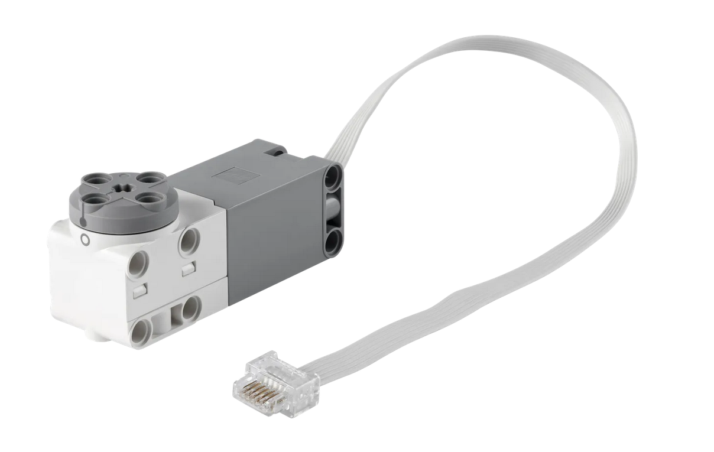{width="640"}

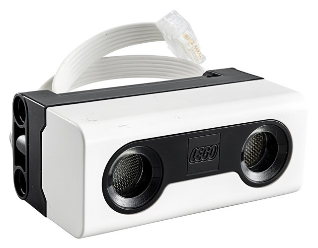{width="475"}

</center>

<br>

We will introduce the motors first and then the distance sensor later.

The aims of this activity are:

-   To program the motors to move our robot in straight lines and circles

-   To incorporate the distance sensor into our program and use it top stop movement

<br> <br>

# Straight lines and circles

## Word blocks

To begin we will configure out motors and let our program know they are plugged into slots A & B of the hub. We tell our program these motors are paired so both can be controlled together.

<br>

<center>

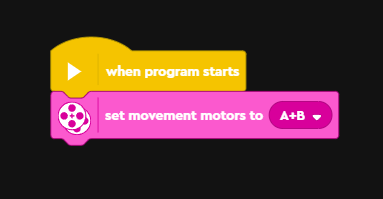

</center>

<br>

After this, we can use one of two movement blocks to make it move forward. I recommend the second as it gives you more control over the direction.

<br>

<center>

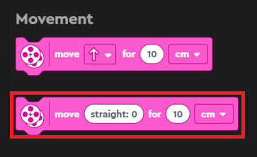

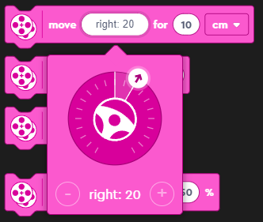

</center>

<br>

A simple program to make our robot move forward would be:

<br>

<center>

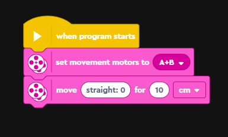

</center>

<br>

To make the robot move backwards we could instead use:

<br>

<center>

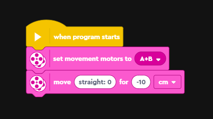

</center>

<br>

<b>Challenge:

-   Try to move the robot forward whilst turning left.

-   Try and make the robot spin in a circle. There are multiple ways to do this with word blocks. </b>

<br><br>

## Python

As before, we're going to translate our program into python. There is a notable change on line 8 where we add `movement_motors = MotorPair("A", "B").`

This is equivalent to the 'set movement motors' word block from earlier. It creates a motor pair and then allows us to use the movement functions.

Then on line 11 we can then use the 'move' function contained inside our motor pair. Move takes four arguments, a number, a unit, the steering and the speed. The number is used in combination with the unit and will determine how much the motors spin. Negative values make them spin backwards. The unit can be 'cm', 'in', 'rotations' or 'degrees'. Steering determines the direction, negative values make the robot turn left and positive values make the robot turn right. A final optional argument is speed, this determines how fast or slow the robot goes and can be between -100 and 100.

As in the previous activity we could consult the python help manual if we wanted more information!

<br>

<center>

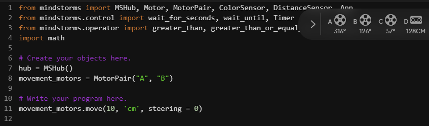

</center>

```{python, eval=FALSE, class.source = 'fold-hide'}

from mindstorms import MSHub, Motor, MotorPair, ColorSensor, DistanceSensor, App
from mindstorms.control import wait_for_seconds, wait_until, Timer
from mindstorms.operator import greater_than, greater_than_or_equal_to, less_than, less_than_or_equal_to, equal_to, not_equal_to
import math

# Create your objects here.
hub = MSHub()
movement_motors = MotorPair("A", "B")

# Write your program here.
movement_motors.move(10, 'cm', steering = 0)


```

Challenge:

-   Make the robot move forwards or backwards using python!

-   Experiment with different units, steering and speed. How do they compare?

-   Can you make the robot spin in a circle?

<br><br>

# Distance sensor

## Word blocks

In our previous example we were just running our robot for set distances. But what if we want our robot to be able to respond to problems it encounters and <i>react</i> to them. To do this we can make use of the distance sensor on the front of the robot. The distance sensor uses ultrasonic signalling to determine how far away objects are. This is like the echolocation animals and submarines use:

<br>

<center>

[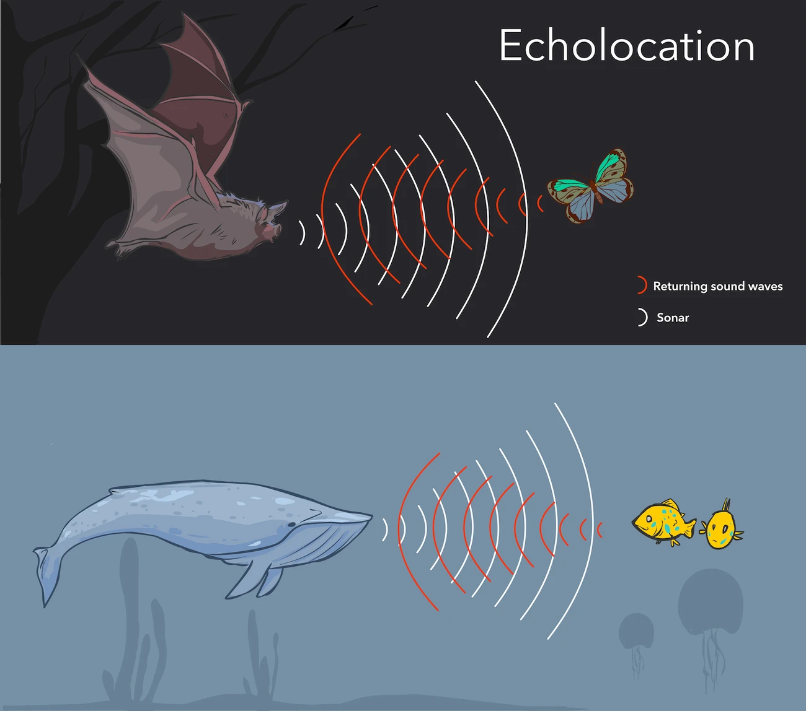](https://www.sciencefocus.com/nature/how-does-echolocation-work/)

</center>

<br>

We are going to create a program that makes our robot:

-   Start moving continuously in a straight line

-   Wait until the distance sensor detects an object/obstacle closer than 10 cm

-   Stop moving

The program is below:

<br>

<center>

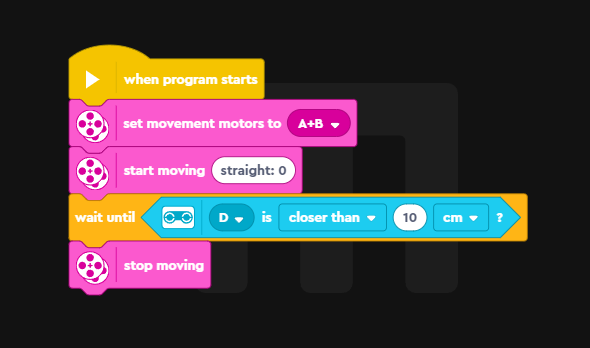

</center>

<br>

You can see in the program we set the motors as port A & B. The distance sensor is plugged into port D and we need to make sure to select that. We use the 'control' block 'wait until' to add the condition, then scroll down to the sensors to find the condition.

<br><br>

## Python

Once again we are going to translate our code into python. Hopefully you're beginning to get a sense of how the word blocks are converted into python code.

In the previous section we added a line to our python code that let us use the motor functions. Now there is an additional command (line 9) to let us access the distance sensor functions.

Lines 12-14 then contain our program. It follows the same basic steps as the word blocks above. The distance sensor object contains the function `wait_for_distance_closer_than()` which we pass a number and unit to. After the distance sensor registers something closer than 10 cm it then moves onto the next line and stops the motors.

<br>

<center>

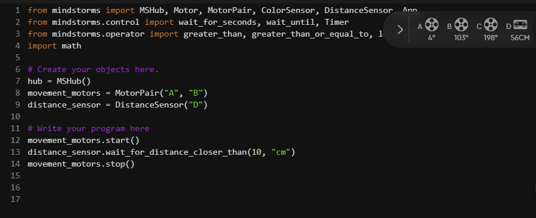

</center>

```{python, eval=FALSE, class.source = 'fold-hide'}

from mindstorms import MSHub, Motor, MotorPair, ColorSensor, DistanceSensor, App
from mindstorms.control import wait_for_seconds, wait_until, Timer
from mindstorms.operator import greater_than, greater_than_or_equal_to, less_than, less_than_or_equal_to, equal_to, not_equal_to
import math

# Create your objects here.
hub = MSHub()
movement_motors = MotorPair("A", "B")
distance_sensor = DistanceSensor("D")

# Write your program here
movement_motors.start()
distance_sensor.wait_for_distance_closer_than(10, "cm")
movement_motors.stop()


```

<br>

<b>Challenge: can you create a program that makes the robot move backwards when the distance sensor is covered by an obstacle (e.g. your hand)? You can first try constructing this using the word blocks. </b>

If you get stuck the code is below (click the 'code' button to reveal):

```{python, eval=FALSE, class.source = 'fold-hide'}

from mindstorms import MSHub, Motor, MotorPair, ColorSensor, DistanceSensor, App
from mindstorms.control import wait_for_seconds, wait_until, Timer
from mindstorms.operator import greater_than, greater_than_or_equal_to, less_than, less_than_or_equal_to, equal_to, not_equal_to
import math

# Create your objects here.
hub = MSHub()
movement_motors = MotorPair("A", "B")
distance_sensor = DistanceSensor("D")

# Write your program here
distance_sensor.wait_for_distance_closer_than(10, "cm")
# Speed was set to 40 so the backwards movement isn't too jumpy
movement_motors.move(-10, 'cm', steering = 0, speed = 40)


```

<br>

A problem you might have encountered when trying to program this, and in the above code, is that it only triggers once. You put your hand in front for example, the robot moves backwards, then it doesn't do anything again. This is because it has reached the end of the program and won't cycle back through the code.

In the [speakers and sound](mindstorm3.html) activity we used a <i>for loop</i> to loop through out code a set number of times. We could apply this idea to our program (click the 'code' button to reveal):

```{python, eval=FALSE, class.source = 'fold-hide'}

from mindstorms import MSHub, Motor, MotorPair, ColorSensor, DistanceSensor, App
from mindstorms.control import wait_for_seconds, wait_until, Timer
from mindstorms.operator import greater_than, greater_than_or_equal_to, less_than, less_than_or_equal_to, equal_to, not_equal_to
import math

# Create your objects here.
hub = MSHub()
movement_motors = MotorPair("A", "B")
distance_sensor = DistanceSensor("D")

# Write your program here
for i in range(3):
    distance_sensor.wait_for_distance_closer_than(10, "cm")
    movement_motors.move(-10, 'cm', steering = 0, speed = 40)

```


<br>

This means our program will loop three times, meaning waits for the distance sensor to be triggered three times. But this still has the problem of only working a limited number of times and then stopping. What if we want our robot to respond whenever the trigger occurs? We can use another type of loop called a <i>'while loop'</i> to do so. We are going to create a while loop that loops forever, meaning the program will trigger every time the distance sensor detects something closer them 10 cm. Try the code below and see what happens (click the 'code' button to reveal):

```{python, eval=FALSE, class.source = 'fold-hide'}

from mindstorms import MSHub, Motor, MotorPair, ColorSensor, DistanceSensor, App
from mindstorms.control import wait_for_seconds, wait_until, Timer
from mindstorms.operator import greater_than, greater_than_or_equal_to, less_than, less_than_or_equal_to, equal_to, not_equal_to
import math

# Create your objects here.
hub = MSHub()
movement_motors = MotorPair("A", "B")
distance_sensor = DistanceSensor("D")

# Write your program here
while True:
    distance_sensor.wait_for_distance_closer_than(10, "cm")
    movement_motors.move(-10, 'cm', steering = 0, speed = 40)

```

This is the equivalent of using the 'forever' word block. Don't worry if this seems quite complex and confusing, these are difficult concepts that would normally take weeks or months of study to fully wrap your head around. The idea here is just to showcase what is possible with python.

<br><br>

# Summary

In this activity we have learned how to:

-   Move our robot

-   Get it to respond interactively to obstacles using the distance sensor

-   Expanded on <i>for loops</i> and introduced the idea of <i>while loops</i>.

<br>


