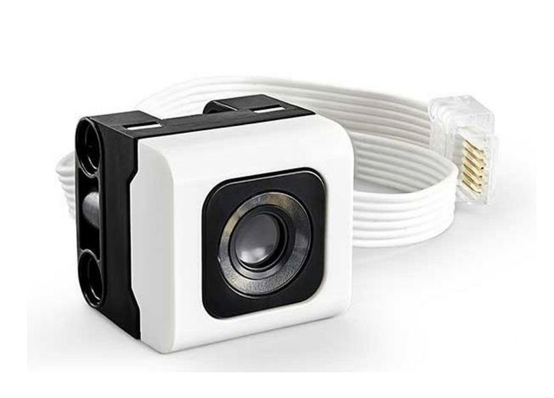
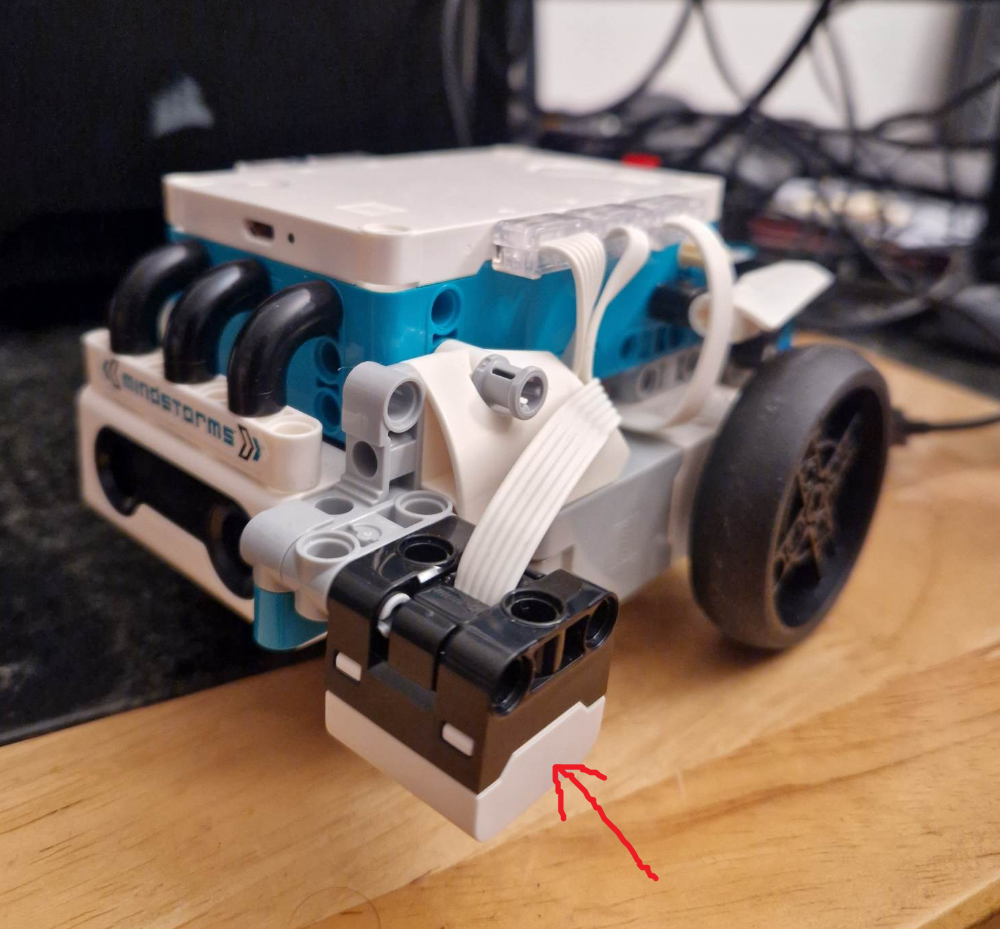
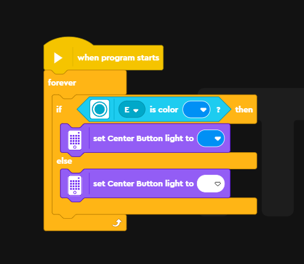
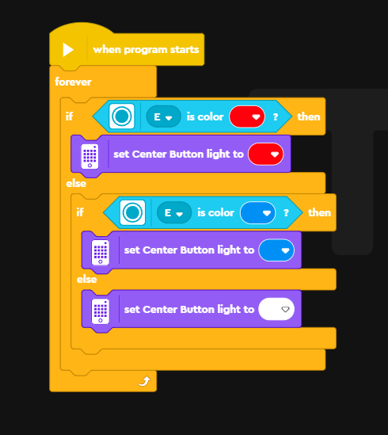
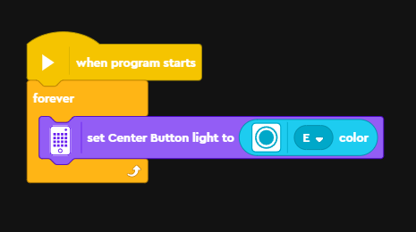
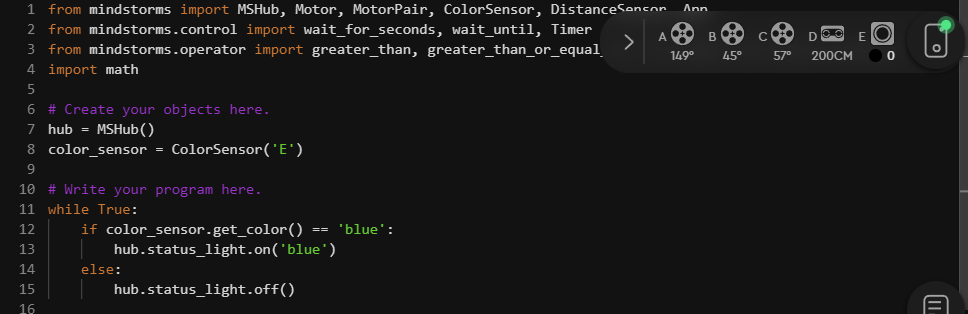
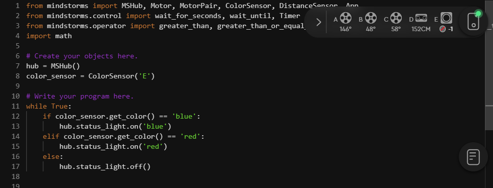
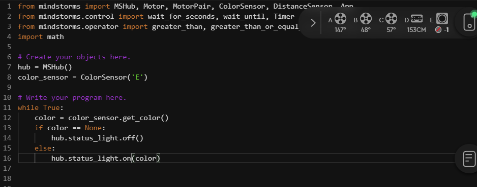

```{r setup, include=FALSE}
knitr::opts_chunk$set(echo = TRUE)
```

<br>

# Introduction

In this activity we are going to introduce an additional sensor: the colour sensor.

<center>

{width="477"}

{width="473"}

</center>

<br>

The colour sensor projects a bright white light outwards, it then reads the colour and intensity of light reflected backwards. This can be used to differentiate between different colours but also between light and dark surfaces as light surfaces tend to reflect light back and dark surfaces tend to absorb it.

<br><br>

# Colour detector

## Word blocks

We are going to demonstrate the use of the colour sensor by creating a program that will detect when the sensor picks up a certain colour. In this case, blue! The program is below:

<br>

<center>



</center>

<br>

In the [speakers and sound](mindstorm3.html) and [motors and movement](mindstorm4.html) activities we demonstrated the use of <i>for loops</i> and <i>while loops</i> in python. The 'forever' block is the equivalent of a forever while loop. We then use a control block that adds a condition to our loop. What this does is:

-   *If* the light sensor detects blue, then set the center light button to blue

-   *Else*, set the center light button to white

The program loops through these conditions forever so it will evaluate if the sensor is still seeing blue each loop. A demonstration of the program working is below:

<center>

<br>


</center>

<br>

<b>Challenge: can you modify the program so it responds to a different colour instead? For example, red or green? Can you modify the program so it will respond to multiple colours? (Two or more.)</b>

<br>

Modifying the above program to respond to multiple colours can be surprisingly tricky. We either need to use event blocks or nested control blocks. You can see an example by clicking the button below:

<button class="btn btn-primary" data-toggle="collapse" data-target="#BlockName">

Show/Hide

</button>

::: {#BlockName .collapse}
<center>



</center>
:::

<br>

But we can actually make this much more simple. Click 'show/hide' to reveal the program:

<button class="btn btn-primary" data-toggle="collapse" data-target="#BlockName2">

Show/Hide

</button>

::: {#BlockName2 .collapse}
<center>



</center>
:::

<br>

This program once again loops forever. But we simplify it by telling it to set the center light button to whatever colour the colour sensor is currently sensing. Try it yourself and see it in action.

<br><br>

## Python

Let's convert the above program into python code. We'll start with the simple version that only responds to blue:

<br>

<center>



</center>

```{python, eval=FALSE, class.source = 'fold-hide'}

from mindstorms import MSHub, Motor, MotorPair, ColorSensor, DistanceSensor, App
from mindstorms.control import wait_for_seconds, wait_until, Timer
from mindstorms.operator import greater_than, greater_than_or_equal_to, less_than, less_than_or_equal_to, equal_to, not_equal_to
import math

# Create your objects here.
hub = MSHub()
color_sensor = ColorSensor('E')

# Write your program here.
while True:
    if color_sensor.get_color() == 'blue':
        hub.status_light.on('blue')
    else:
        hub.status_light.off()


```

<br>

We begin using similar steps to the previous exercise. We first create a 'color_sensor' object that allows us to access functions inside the colour sensor (plugged into slot 'E').

Then we begin our program.

We first start a forever while loop. This will keep looping infinitely as long as the program is running. Whilst that while loop is running we pass it two conditions to keep evaluating:

-   *If* the light sensor detects blue, then set the center light button to blue

-   *Else*, turn off the center light button

We make use of three functions here: `color_sensor.get_color()`, `hub.status_light.on()`, and `hub.status_light.off()`.

<br>

In the word block section we improved our program in two steps. We'll first add a second colour to our code. When we used the word blocks we had to use nested control blocks. Here we can use a new control statement *'elif'* which is short for 'else if'. You can have multiple 'elif' statements between your 'if' and 'else' ones.

<center>



</center>

```{python, eval=FALSE, class.source = 'fold-hide'}

from mindstorms import MSHub, Motor, MotorPair, ColorSensor, DistanceSensor, App
from mindstorms.control import wait_for_seconds, wait_until, Timer
from mindstorms.operator import greater_than, greater_than_or_equal_to, less_than, less_than_or_equal_to, equal_to, not_equal_to
import math

# Create your objects here.
hub = MSHub()
color_sensor = ColorSensor('E')

# Write your program here.
while True:
    if color_sensor.get_color() == 'blue':
        hub.status_light.on('blue')
    elif color_sensor.get_color() == 'red':
        hub.status_light.on('red')
    else:
        hub.status_light.off()

```

<br>

Our next step was to simplify the program and get the center light to change to any colour the sensor can detect. When we translate this to python it looks like this:

<center>



</center>

```{python, eval=FALSE, class.source = 'fold-hide'}

from mindstorms import MSHub, Motor, MotorPair, ColorSensor, DistanceSensor, App
from mindstorms.control import wait_for_seconds, wait_until, Timer
from mindstorms.operator import greater_than, greater_than_or_equal_to, less_than, less_than_or_equal_to, equal_to, not_equal_to
import math

# Create your objects here.
hub = MSHub()
color_sensor = ColorSensor('E')

# Write your program here.
while True:
    color = color_sensor.get_color()
    if color == None:
        hub.status_light.off()
    else:
        hub.status_light.on(color)


```

<br>

This solution isn't as short or punchy as our word block one. This is because when we use the function `color_sensor.get_color()` it can sometimes return None. This is when the sensor isn't able to detect anything (for example when you're holding it up in the air). If we tried to pass None to `hub.status_light.on()` it would cause an error. So we first evaluate if the sensor can detect a colour. If it can't (i.e. if the color is None) it turns the status light off. If it can detect a colour (i.e. the colour ISN'T None), it changes the status light colour to whatever the sensor detected.

<br><br>

# Summary

In this activity we:

-   Learned how to use the colour sensor

-   Expanded on the idea of *'while loops'* and introduced control statements to them

Loops and control statements might be difficult concepts to wrap your head around - don't worry these are quite advanced! But this showcases techniques that are widely used not just in robotics but programming in general.

<br>


